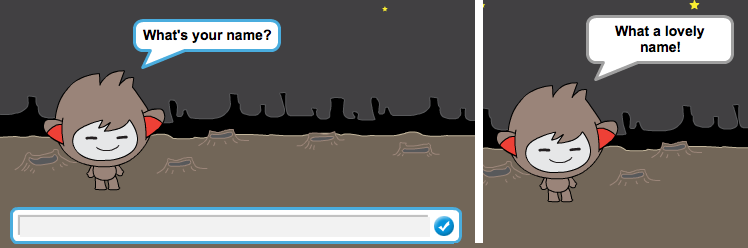

## Говорящий чатбот

Теперь, когда у вас есть чат-бот с личностью, давайте попробуем поговорить с вами.

\--- задача \---

Добавьте код в свой чатбот, чтобы при нажатии на него было задано ваше имя, а затем сказано: «Какое прекрасное имя!»

\--- hints \--- \--- hint \--- Когда щелчок на чатботе **будет нажат**, он должен **спросить** за ваше имя. Чатбот должен тогда **сказать** «Какое прекрасное имя!» \--- / hint \--- \--- hint \--- Вот коды, которые вам понадобятся:  \--- / hint \--- \--- hint \--- Вот как ваш код должен выглядеть:  \--- / hint \--- \--- / hints \---

\--- / задача \---

\--- задача \---

Теперь чатбот просто отвечает: «Какое прекрасное имя!» каждый раз. Можете ли вы персонализировать ответ чатбота, используя свой ответ?

\--- hints \--- \--- hint \--- Когда щелчок на чатботе **будет нажат**, он должен **спросить** за ваше имя. Чатбот должен тогда **сказать** «Привет», а затем ваш **ответ**. \--- / hint \--- \--- hint \--- Вот коды, которые вам понадобятся:  \--- / hint \--- \--- hint \--- Вот как ваши код должен выглядеть:  \--- / hint \--- \--- / hints \---

\--- / задача \---

\--- задача \---

Если вы храните свой ответ в **переменной**, то он может быть использован позже. Создайте новую переменную с именем `name` чтобы сохранить ваше имя.

[[[generic-scratch-add-variable]]]

\--- / задача \---

\--- задача \---

Можете ли вы сохранить свой ответ в переменной `name` и использовать его в ответе чатбота?

Ваш код должен работать по-прежнему: ваш чатбот должен приветствовать вас, используя ваше имя.

\--- hints \--- \--- hint \--- Когда щелчок на чатботе **будет нажат**, он должен **спросить** за ваше имя. Затем вы должны **установить** `Имя` переменной к вашему **ответа**. Chatbot должен тогда **сказать** «Привет», а затем свой **имя**. \--- / hint \--- \--- hint \--- Вот коды, которые вам понадобятся:  \--- / hint \--- \--- hint \--- Вот как ваши код должен выглядеть:  \--- / hint \--- \--- / hints \---

\--- / задача \---

\--- вызов \---

## Задача: больше вопросов

Запросите свой чатбот, чтобы задать другой вопрос. Можете ли вы сохранить ответ в новой переменной?

 \--- /вызов \---