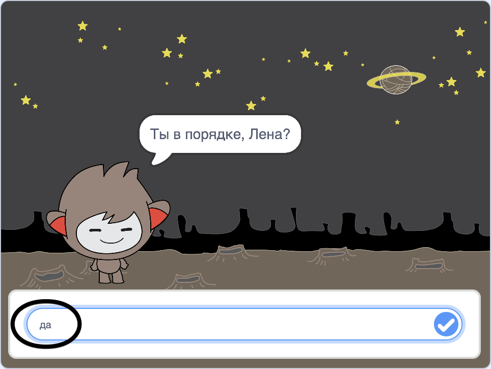
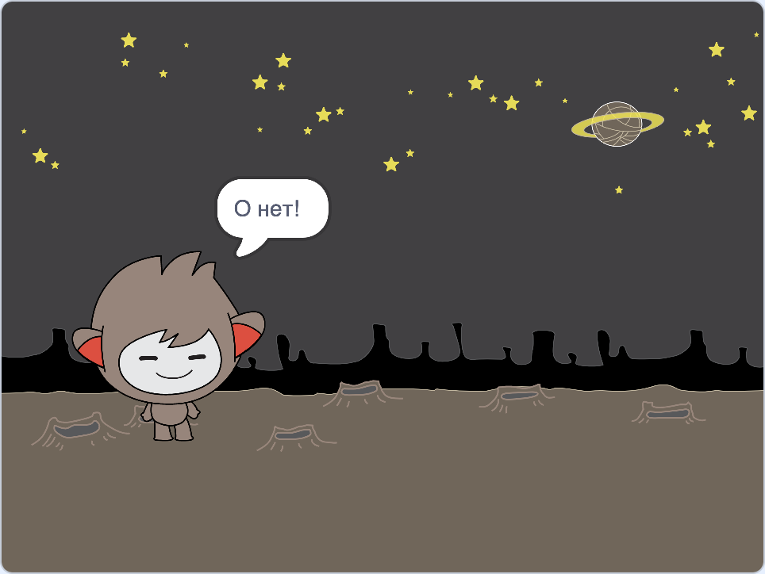
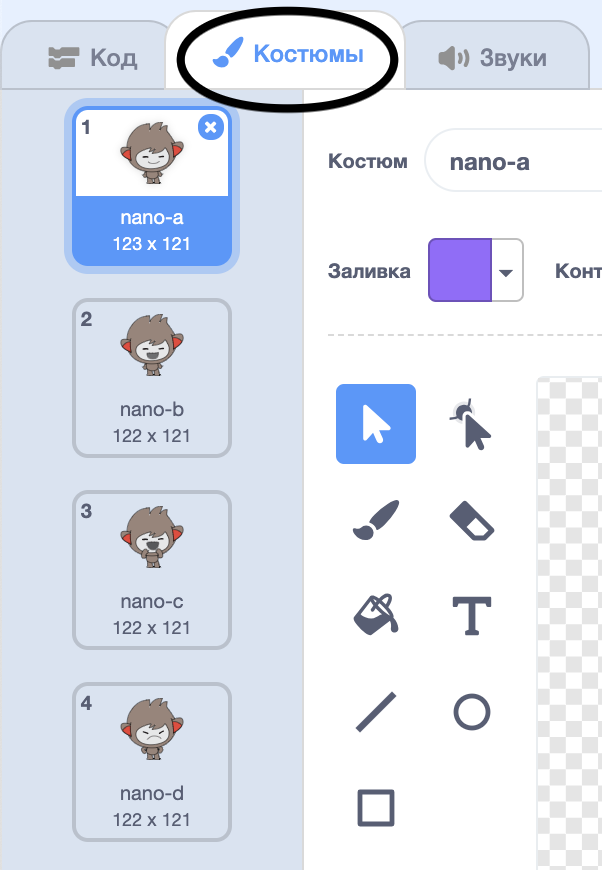
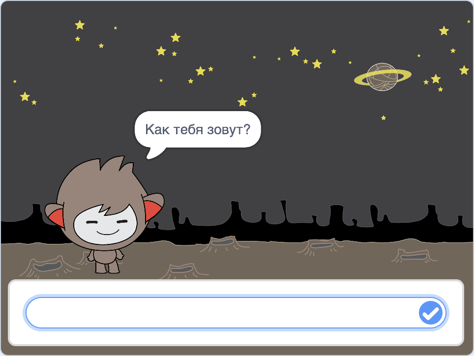

## Принятие решений

Ты можешь запрограммировать своего чат-бота, чтобы он решал, что делать на основе полученных ответов.

Во-первых, ты сделаешь так, чтобы чат-бот задавал вопрос, на который можно ответить "да" или "нет".

\--- task \---

Измени код твоего чат-бота. Твой чат-бот должен задавать вопрос «Всё в порядке, имя», используя переменную `имя`{:class="block3variables"}. Затем он должен ответить "Это приятно слышать!" `если`{:class="block3control"}, ответ, который он получает, "да", но ничего не говорить, если ответ "нет".




```blocks3
когда спрайт нажат
спросить [Как тебя зовут?] и ждать
задать [имя v] значение (ответ)
говорить (объединить [Привет, ] (имя)) (2) секунд
+спросить (объединить [Ты в порядке, ] (имя)) и ждать
+если <(ответ) = [да]>, то 
  говорить [Это приятно слышать!] (2) секунд
конец
```

Чтобы правильно проверить новый код, ты должен проверить его **дважды**: один раз с ответом «да» и один раз с ответом «нет».

\--- /task \---

В данный момент твой чат-бот ничего не говорит в ответ на «нет».

\--- task \---

Измени код твоего чат-бота, чтобы он отвечал «О, нет!», если он получает «нет» в качестве ответа на «Ты в порядке, <имя>».

Замени блок `если, то`{:class="block3control"} на блок `если, то, иначе`{:class="block3control"} и добавь код, чтобы чат-бот мог `сказать "О, нет!"`{:class="block3looks"}.


```blocks3
когда спрайт нажат
спросить [Как тебя зовут?] и ждать
задать [имя v] значение (ответ)
говорить (объединить [Привет, ] (имя)) (2) секунд
спросить (объединить [Ты в порядке, ] (имя)) и ждать

+ если <(ответ) = [да]>, то 
  говорить [Это приятно слышать!] (2) секунд
иначе 
+  говорить [О нет!] (2) секунд
конец
```

\--- /task \---

\--- task \---

Проверь свою программу. Ты должен получить разные ответы, когда отвечаешь «нет» и когда отвечаешь «да»: твой чат-бот должен сказать «Это приятно слышать!», когда ты говоришь «да» (которое не учитывает регистр букв) и отвечает «О, нет!», когда ты говоришь **что-либо другое**.




\--- /task \---

Ты можешь поместить любой код в блок `если, то, иначе`{:class="block3control"}, а не просто код, заставляющий твоего чат-бота говорить!

Если ты перейдешь на вкладку **Костюмы** твоего чат-бота, то увидишь, что существует больше одного костюма.



\--- task \---

Измени код твоего чат-бота, чтобы он переключал костюмы при вводе ответа.


Измени код внутри `если, то, иначе`{:class="block3control"} на `изменить костюм на`{:class="block3looks"}.


```blocks3
когда спрайт нажат
спросить [Как тебя зовут?] и ждать
задать [имя v] значение (ответ)
говорить (объединить [Привет, ] (имя)) (2) секунд
спросить (объединить [Ты в порядке, ] (имя)) и ждать
если <(ответ) = [да]>, то 

+  изменить костюм на (nano-c v)
  говорить [Это приятно слышать!] (2) секунд
иначе 
+  изменить костюм на (nano-d v)
  говорить [О нет!] (2) секунд
конец
```

Протестируй и сохрани свою программу. Ты должен увидеть изменение лица твоего чат-бота в зависимости от твоего ответа.

\--- /task \---

Заметил ли ты, что после того, как костюм твоего чат-бота изменился, он остается таким же и не меняется обратно на тот, что был в начале?

Ты можешь попробовать следующее: запусти свой код и ответь «нет», чтобы лицо твоего чат-бота изменилось на несчастное. Затем снова запусти свой код и обрати внимание, что твой чат-бот не изменится на счастливого, пока не спросит твое имя.


\--- task \---

Чтобы решить эту проблему, добавь к коду чат-бота блок `изменить костюм на`{:class="block3looks"} в начале `когда спрайт нажат`{:class="block3events"}.


```blocks3
когда спрайт нажат

+ изменить костюм на (nano-a v)
спросить [Как тебя зовут?] и ждать
```



\--- /task \---