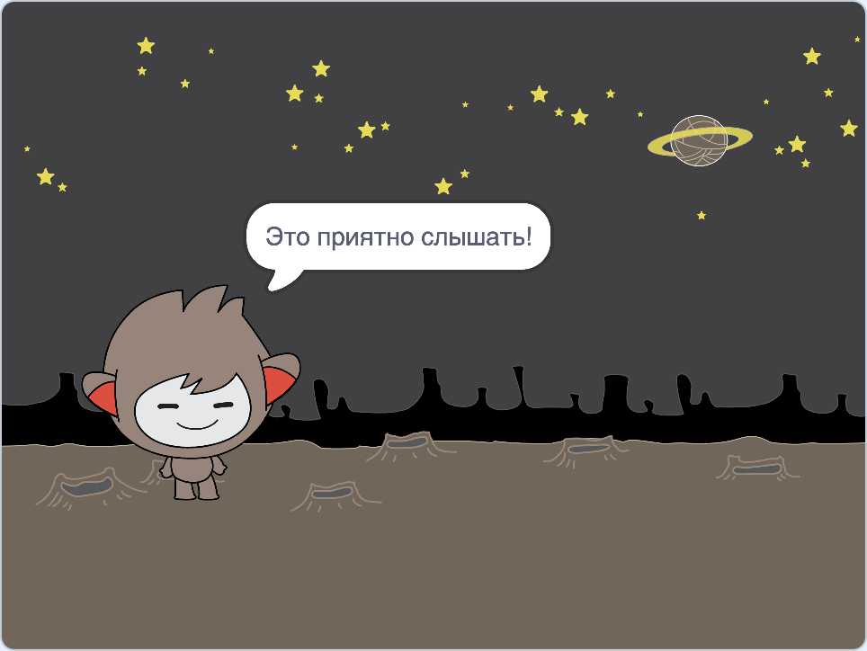
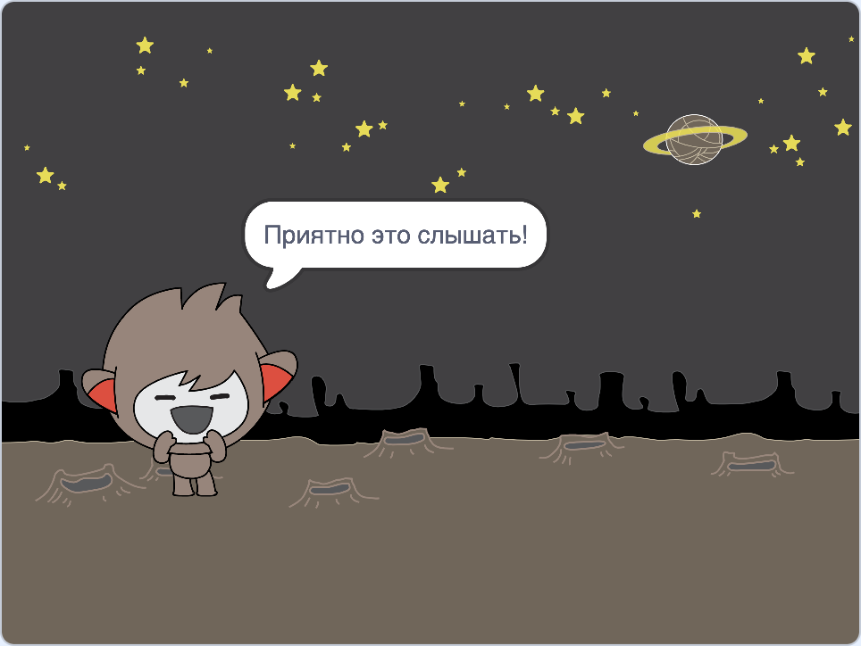
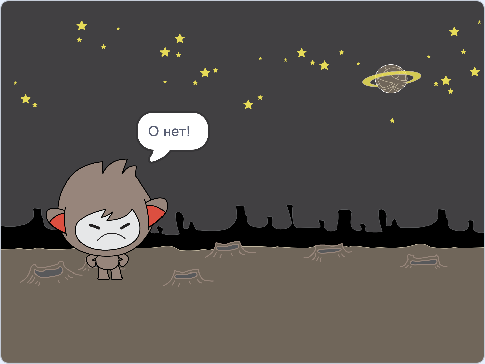

## Принятие решений

Ты можешь запрограммировать своего чат-бота, чтобы он решал, что делать на основе полученных ответов.

Во-первых, ты собираешся заставить твоего чат-бота задавать вопрос, на который можно ответить "да" или "нет".

\--- task \---

Измени код твоего чат-бота. Твой чат-бот должен задавать вопрос «Всё в порядке, имя», используя переменную `имя`{:class="block3variables"}. Затем он должен ответить "Это приятно слышать!" `если`{:class="block3control"}, ответ, который он получает, "да", но ничего не говорит, если ответ "нет".





```blocks3
когда этот спрайт нажал
спросите [Как вас зовут?] и подождите
установите [имя v] на (ответ)
произнесите (присоединитесь к [Привет] (имя)) в течение (2) секунд
+ спросите (присоединитесь к [Вы в порядке] (имя)) и ждите
+, если <(ответ) = [yes]> затем 
  сказать [Это приятно слышать!] в течение (2) секунд
конец
```

Чтобы правильно проверить новый код, вы должны проверить его **дважды**: один раз с ответом «да» и один раз с ответом «нет».

\--- / задача \---

В данный момент ваш чат-бот ничего не говорит в ответ «нет»

\--- задача \---

Измените код вашего чата, чтобы он отвечал "О, нет!" если он получает «нет» в качестве ответа на «Ты в порядке имя».

Замените блок `if, затем`{: class = "block3control"} на блок `if, тогда еще`{: class = "block3control"} и включите код, чтобы чат- `мог сказать "О, нет!"`{: class = "block3looks"}.


```blocks3
когда этот спрайт нажал
спросите [Как вас зовут?] и подождите
установите [имя v] на (ответ)
произнесите (присоединитесь к [Привет] (имя)) в течение (2) секунд
спросите (присоединитесь к [Вы в порядке] ( имя)) и подождите

+, если <(ответ) = [yes]> затем 
  сказать [Это приятно слышать!] в течение (2) секунд
еще 
+ сказать [О нет!] в течение (2) секунд
конец
```

\--- / задача \---

\--- задача \---

Проверьте свой код. Вы должны получить другой ответ, когда отвечаете «нет» и когда отвечаете «да»: ваш чат-робот должен ответить «Это приятно слышать!» когда вы отвечаете «да» (который не учитывает регистр) и отвечаете «О, нет!» когда вы отвечаете **что-нибудь еще**.


\--- / задача \---

Вы можете поместить любой код в `если, тогда, еще`{: class = "block3control"} блок, а не просто код, чтобы заставить вашего чат-бота говорить!

Если вы перейдете на вкладку **Costumes** вашего чатбота, то увидите, что существует более одного костюма.


\--- задача \---

Измените код вашего чат-бота, чтобы он переключал костюмы при вводе ответа.





Измените код внутри `если, тогда, еще`{: class = "block3control"} на `переключают костюм`{: class = "block3looks"}


```blocks3
когда этот спрайт нажал
спросите [Как вас зовут?] и подождите
установите [имя v] на (ответ)
произнесите (присоединитесь к [Привет] (имя)) в течение (2) секунд
спросите (присоединитесь к [Вы в порядке] ( имя)) и подождите
если <(ответ) = [yes]> затем 

+ переключите костюм на (nano-c v)
  скажите [Это приятно слышать!] в течение (2) секунд
 
+ переключите костюм на (нано- d v)
  произнесите [О нет!] в течение (2) секунд
end
```

Протестируйте и сохраните ваш код. Вы должны увидеть изменение лица вашего чат-бота в зависимости от вашего ответа.

\--- / задача \---

Заметили ли вы, что после того, как костюм вашего чат-бота изменился, он остается таким же и не меняется обратно к тому, что был в начале?

Вы можете попробовать это: запустите свой код и ответьте «нет», чтобы лицо вашего чат-бота изменилось на несчастный. Затем снова запустите свой код и обратите внимание, что ваш чат-робот не изменится на то, чтобы выглядеть счастливым, пока не спросит ваше имя.


\--- задача \---

Чтобы решить эту проблему, добавьте к коду чат-бота значение `костюм`{: class = "block3looks"} в начале `при нажатии спрайта`{: class = "block3events"}.


```blocks3
когда этот спрайт нажал

+ переключить костюм на (nano-a v)
спросите [как вас зовут?] и подождите
```


\--- / задача \---