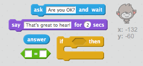

## Шаг 3: принятие решений

Вы можете запрограммировать свой чатбот, чтобы решить, что сказать или сделать, исходя из ваших ответов на его вопросы.

\--- задача \---

Можете ли вы сделать чат-бот, задав вопрос «Вы в порядке?», И запрограммируйте его, чтобы ответить «Это здорово слышать!» только **если** пользователь отвечает «да»?

Чтобы проверить свой новый код правильно, вы должны проверить его **дважды**, один раз с ответом «да» и один раз с ответом «нет».

Ваш чатбот должен ответить «Это здорово!» если вы ответите «да», но не говорите ничего, если вы ответите «нет».

\--- Рекомендации \--- \--- намек \--- После того, как ваш Chatbot сказал «Привет», он должен теперь **спросить** «Вы в порядке?». **Если** вы ответите «да», то чатбот должен **сказать** «Это здорово слышать!». \--- / hint \--- \--- hint \--- Вот дополнительные блоки кода, которые вам понадобятся:  \--- / hint \--- \--- hint \--- Вот как ваш код должен выглядеть:  \--- / hint \--- \--- / hints \---

\--- / задача \---

\--- задача \---

На данный момент ваш чатбот ничего не говорит, если вы ответите «нет». Можете ли вы изменить свой чатбот, чтобы он также ответил «О нет!». если вы ответите «нет» на его вопрос?

Проверьте и сохраните. Теперь ваш чатбот должен сказать «О нет!» если вы ответите «нет». На самом деле он скажет: «Нет!» если вы отвечаете ничем иным, чем «да» ( **else** в блоке `if / else` означает **противном случае**).

\--- hints \--- \--- hint \--- Теперь ваш chatbot должен сказать: «Это здорово слышать!» **если** ваш ответ «да», но должен сказать «О нет!». если вы что - то ответить **еще**. \--- / hint \--- \--- hint \--- Вот коды, которые вам нужно использовать:  \--- / hint \--- \--- hint \--- Вот как выглядит ваш код:  \--- / hint \--- \--- / hints \---

\--- / задача \---

\--- задача \---

Вы можете поместить любой код внутри блока `if / else` , а не только код, чтобы ваш чатбот говорил. Если щелкнуть ваш Chatbot в **Costume** вкладку, вы увидите , что она имеет более чем один костюм.

\--- / задача \---

\--- задача \---

Можете ли вы изменить костюм чатбота в соответствии с вашим ответом?

Проверьте и сохраните. Вы должны увидеть изменение лица чатбота в зависимости от вашего ответа.

\--- hints \--- \--- hint \--- Ваш чатбот должен теперь также **переключателя костюма** зависимости от ответа. \--- / hint \--- \--- hint \--- Вот коды, которые вам нужно использовать:  \--- / hint \--- \--- hint \--- Вот как выглядит ваш код:  \--- / hint \--- \--- / hints \---

\--- / задача \---

\--- задача \---

Вы заметили, что ваш костюм chatbot остается таким же, как и в последний раз, когда вы говорили с ним? Вы можете решить эту проблему?

Тест и сохранение: запустите свой код и введите «нет», чтобы ваш чатбот выглядел несчастным. Когда вы снова запустите свой код, ваш чатбот должен вернуться на улыбающееся лицо, прежде чем спрашивать ваше имя.

\--- hints \--- \--- hint \--- Когда **спрайта нажата**, ваш чатбот должен сначала **переключить костюм** на улыбающееся лицо. \--- / hint \--- \--- hint \--- Вот код, который вам нужно добавить:  \--- / hint \--- \--- hint \--- Вот как ваш код должен выглядеть:  \--- / hint \--- \--- / hints \---

\--- / задача \---

\--- вызов \---

## Задача: больше решений

Запросите свой чатбот, чтобы задать другой вопрос - что-то с ответом «да» или «нет». Можете ли вы ответить на ответ чатбота?

 \--- /вызов \---