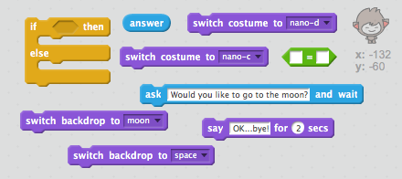

## Изменение местоположения

Вы также можете закодировать свой чатбот, чтобы изменить его местоположение.

\--- задача \---

Добавьте еще один фон в свою сцену, например, «лунный» фон.

\--- / задача \---

\--- задача \---

Можете ли вы закодировать свой чатбот, чтобы спросить: «Хочешь пойти на Луну?» а затем измените местоположение, если вы ответите «да»?

Проверьте и сохраните. Если вы ответите «да», ваш чатбот должен изменить местоположение. Ваш чатбот должен выглядеть грустным и говорить «ОК ... пока!» если дается какой-либо другой ответ.

\--- подсказки \--- \--- подсказка \--- Ваш чатбот должен **спросить** «Хочешь пойти на луну?». **Если** ваш **ответ** «да», то ваш чатбот должен **изменить костюм** чтобы выглядеть счастливым, а фон **этапа** должен измениться.

Если вы ответили «нет», то Chatbot следует **изменить костюм** смотреть грустно и **говорят** «ОК ... до свидания!»

Вам также нужно будет добавить код, чтобы запустить чатбот в нужном месте **при нажатии**. \--- / hint \--- \--- hint \--- Вот коды, которые вам нужно использовать:  \--- / hint \--- \--- hint \--- Вот как выглядит ваш код:  \--- / hint \--- \--- / hints \---

\--- / задача \---

\--- задача \---

Можете ли вы добавить код, чтобы заставить чатбот прыгать от радости, если вы скажете, что хотите отправиться на Луну?

Проверьте и сохраните. Если вы ответите «да», ваш чатбот должен прыгать вверх и вниз. Ваш чатбот не должен прыгать, если дается какой-либо другой ответ.

\--- hints \--- \--- hint \--- Ваш chatbot должен прыгать на **изменяя** своей **й позиции** на небольшую сумму, а затем меняя свое положение назад после короткого **ожидания**. Вы можете **повтор** это несколько раз. \--- / hint \--- \--- hint \--- Вот коды, которые вам нужно использовать:  \--- / hint \--- \--- hint \--- Вот как выглядит ваш код:  \--- / hint \--- \--- / hints \---

\--- / задача \---