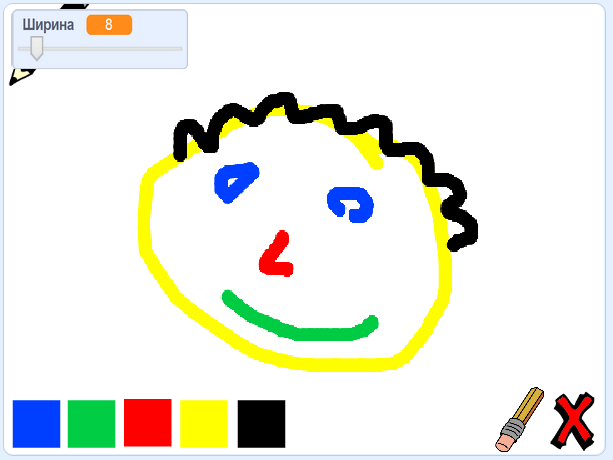

## Что дальше?

Попробуй проект [Коробка красок](https://projects.raspberrypi.org/ru-RU/projects/paint-box?utm_source=pathway&utm_medium=whatnext&utm_campaign=projects), где ты создашь свою программу для рисования!

--- no-print --- Нажми на зеленый флаг, чтобы начать. Используй мышку, чтобы перемещать карандаш и удерживай левую кнопку мышки для рисования. Нажми на цвет, чтобы поменять карандаши. Нажми на ластик, чтобы переключиться на него, и используй его, чтобы стереть свою работу. Чтобы очистить страницу, нажми на крестик.

  <iframe allowtransparency="true" width="485" height="402" src="//scratch.mit.edu/projects/embed/354189326/?autostart=false" frameborder="0" scrolling="no"></iframe>
  

--- /no-print ---

--- print-only --- Когда ты нажмешь на зеленый флаг, чтобы начать, ты будешь использовать мышку, чтобы перемещать карандаш, а удерживая левую кнопку мышки - чтобы рисовать. Нажатие на цвет изменит цвет карандаша, а нажатие на ластик сменит на ластик!

 --- /print-only ---

**Перевод силами сообщества**

Этот проект для вас подготовили: переводчик: **Сергей Градович**, корректор: **Максим Рябцев**.

Наши замечательные переводчики-добровольцы помогают нам дать детям со всего мира шанс научиться программировать. Ты можешь помочь нам привлечь больше детей, помогая переводить наши проекты. Подробнее на [rpf.io/translate](https://rpf.io/translate).
