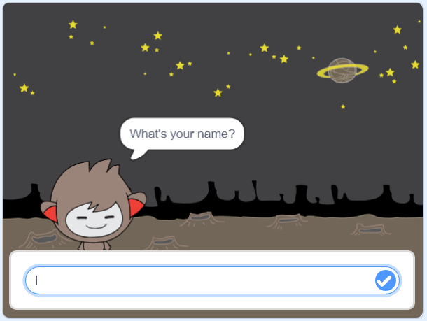

## කතා කරන චැට්බෝට්(chatbot)

දැන් ඔබට පෞරුෂයක්(personality එකක්) සහිත චැට්බෝට්(chatbot) එකක් ඇති බැවින්, එය ඔබ සමඟ කතා කරන පරිදි වැඩසටහන්ගත(program) කිරීමට හැකියි.

\--- task \---

ඔබගේ චැට්බෝට්(chatbot) sprite එක මත ක්ලික් කර මෙම කේතය එයට එක් කරන්න. එවිට `එය ක්ලික් කළ විට`{: class = "block3events"}, එය `ඔබේ නම ඉල්ලාවි`{:class="block3sensing"} ඉන්පසු එය ` "මොනතරම් ලස්සන නමක්දැයි!"`{:class="block3looks"} පවසාවි.


```blocks3
when this sprite clicked
ask [What's your name?] and wait
say [What a lovely name!] for (2) seconds
```

\--- /task \---

\--- task \---

ඔබේ කේතය(code එක) පරීක්ෂා(test) කිරීමට ඔබගේ චැට්බෝට්(chatbot එක) එක මත ක්ලික් කරන්න. චැට්බෝට්(chatbot) එක ඔබේ නම ඉල්ලූ විට, එය වේදිකාවේ පතුලේ ඇති කොටුවට ටයිප් කර නිල්(blue) සලකුණ(mark එක) මත ක්ලික් කරන්න, නැතහොත් <kbd>නිවේශන යතුර(Enter)</kbd> ඔබන්න.




\--- /task \---

\--- task \---

මේ මොහොතේ, ඔබේ චැට්බෝට් පිළිතුරු දෙන්නේ "මොනතරම් ලස්සන නමක්ද! (What a lovely name!)" ඔබ පිළිතුරු දෙන සෑම අවස්ථාවකම. ඔබට ලැබෙන චැට්බෝට්ගේ(chatbot ගේ) පිළිතුර වඩාත්(more) පුද්ගලික(personal) එකක් කළ හැකිය, එවිට වෙනස් නමක් ටයිප් කරන සෑම අවස්ථාවකම පිළිතුර වෙනස් වේ.

චැට්බෝට්(chatbot) sprite එකේ කේතය(code එක) "ඔබේ නම කුමක්ද? (What's your name?)" ප්‍රශ්නයට `පිළිතුර`{:class="block3sensing"} "හායි (Hi)" සමඟ `සම්බන්ධ(join)`{:class="block3operators"} වන ලෙස වෙනස් කරන්න, එවිට කේතය(code එක) මේ ආකාරවේ:


```blocks3
when this sprite clicked
ask [What's your name?] and wait
say (join [Hi ] (answer) :: +) for (2) seconds
```


\--- /task \---

\--- task \---

**විචල්‍යයක(variable එකක)** පිළිතුර ගබඩා කිරීමෙන්(storing), ඔබේ ව්‍යාපෘතියේ(project එකේ) ඕනෑම තැනක එය භාවිතා කළ හැකිය.

`නාමය(name)`{:class="block3variables"} නමින් නව(new) විචල්‍යයක්(variable එකක්) සාදන්න.

[[[generic-scratch3-add-variable]]]

\--- /task \---

\--- task \---

දැන්, `නාමය(name)`{:class="block3variables"} විචල්‍යයේ නම `පිළිතුර(answer)`{:class="block3sensing"} ලෙස සැකසීමට, ඔබේ චැට්බෝට්(chatbot) sprite එකේ කේතය(code එක) වෙනස් කරන්න:


```blocks3
when this sprite clicked
ask [What's your name?] and wait

+ set [name v] to (answer)
say (join [Hi ] (name :: variables +)) for (2) seconds
```

ඔබගේ කේතය(code එක) පෙර පරිදිම ක්‍රියාත්මක විය යුතුය: ඔබේ චැට්බෝට්(chatbot) එක ඔබ ටයිප් කරන නම භාවිතා කරමින් හායි!(Hi!) කිව යුතුය.


\--- /task \---

ඔබේ වැඩසටහන(program එක) නැවත පරීක්ෂා(test) කරන්න. ඔබ ටයිප් කරන පිළිතුර(answer එක) `නාමය(name)`{:class="block3variables"} නම් විචල්‍යය(variable එක) තුල ගබඩා කර ඇති බව ඔබට දැකගත හැකිවේවි, එය වේදිකාවේ(stage එකේ) ඉහළ වම් කෙළවරේ ද දැක්වේ. To make it disappear from the Stage, go to the `Variables`{:class="block3variables"} blocks section and click on the box next to `name`{:class="block3variables"} so that it is not marked.