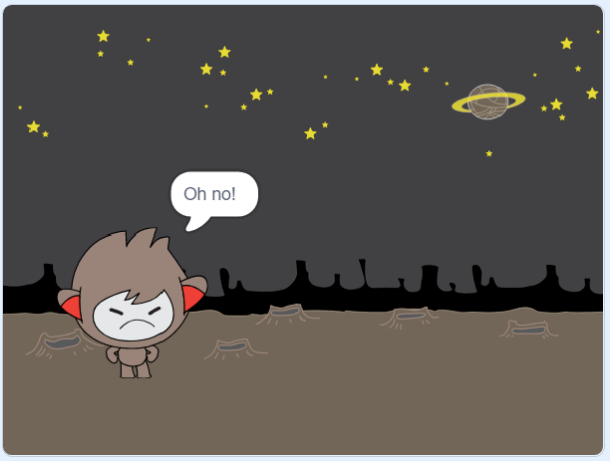

## තීරණ ගැනීම

ඔබට ලැබෙන පිළිතුරු මත පදනම්ව කුමක් කළ යුතුද යන්න තීරණය කිරීම සඳහා ඔබේ චැට්බෝට්(chatbot) වැඩසටහන්ගත(program) කළ හැකිය.

පළමුව, ඔබ ඔබේ චැට්බෝට්(chatbot) එක මගින් "ඔව්(yes)" හෝ "නැත(no)" යනුවෙන් පිළිතුරු දිය හැකි ආකාරයේ ප්‍රශ්නයක් ඇසීමට සලස්වයි.

\--- task \---

ඔබගේ චැට්බෝට්(chatbot) එකේ කේතය(code එක) වෙනස් කරන්න. ඔබේ චැට්බෝට්(chatbot) එක විසින් `නාමය(name)`{:class="block3variables"} විචල්‍යය(variable එක) භාවිතා කරමින් <0>ඔබට කොහොමද නාමය("Are you OK name")</0> යන ප්‍රශ්නය ඇසිය යුතුය. එයට ලැබෙන පිළිතුර "ඔව්"("yes") `නම්(if)`{:class="block3control"} එවිට එය පිළිතුරු දිය යුත්තේ "එය ඇසීමත් සතුටක්!"("That's great to hear!") ලෙසටයි, නමුත් පිළිතුර "නැත"("no") නම් කිසිවක් නොකියා සිටියයුතුයි.


```blocks3
when this sprite clicked
ask [What's your name?] and wait
set [name v] to (answer)
say (join [Hi ] (name)) for (2) seconds
+ask (join [Are you OK ] (name)) and wait
+if <(answer) = [yes]> then
  say [That's great to hear!] for (2) seconds
end
```

ඔබගේ නව කේතය නිසියාකාරව පරීක්ෂා(test) කිරීමට, ඔබ එය **දෙවරක්(twice)** පරීක්ෂා කළ යුතුය: වරක් "ඔව්"("yes") යන පිළිතුර යොදමින් හා, එක් වරක් "නැත"("No") යන පිළිතුර යොදමින් පරීක්ෂා කිරීම වඩා සුදුසු වේ.

\--- /task \---

මේ මොහොතේ, ඔබගේ චැට්බෝට්(chatbot එක) "නැත"("no") යන පිළිතුරට කිසිවක් නොකියයි.

\--- task \---

"ඔබට කොහොමද නාමය" ("Are you OK name") යන ප්‍රශ්නයට "නැත"("no") යන්න පිළිතුර ලෙස ලැබෙන්නේ නම්, එවිට එය "අහො ඛේදයකි!"("Oh no!") ලෙස පිළිවදන් දෙන පරිදි ඔබගේ චැට්බෝට්(chatbot) එකේ කේතය(code එක) වෙනස් කරන්න.

`එසේ නම් මෙසේ(if, then)`{:class="block3control"} කේතය `එසේ නම් මෙසේ නැත්නම්(if, then, else)` {:class="block3control"} කේතය මගින් ප්‍රතිස්ථාපනය කර, චැට්බොට්(chatbot එක) `"අහො ඛේදයකි!"("Oh no!") ලෙස පිළිවදන් දෙන පරිදි`{:class="block3looks"} සකසන්න.


```blocks3
when this sprite clicked
ask [What's your name?] and wait
set [name v] to (answer)
say (join [Hi ] (name)) for (2) seconds
ask (join [Are you OK ] (name)) and wait

+ if <(answer) = [yes]> then
  say [That's great to hear!] for (2) seconds
else 
+ say [Oh no!] for (2) seconds
end
```

\--- /task \---

\--- task \---

ඔබේ කේතය(code එක) පරීක්ෂා(test) කරන්න. ඔබ "නැත(no)" යනුවෙන් පිළිතුරු දෙන විට සහ "ඔව්(yes)" යනුවෙන් පිළිතුරු දෙන විට ඔබට වෙනස් ප්‍රතිචාරයක් ලැබිය යුතුය: ඔබ "ඔව්(yes)" යනුවෙන් පිළිතුරු දෙන විට ඔබේ චැට්බෝට්(chatbot) පිළිතුරු දිය යුත්තේ "එය ඇසීමත් සතුටක්!"("That’s great to hear!") [එය විෂය සංවේදී(case sensitive) නොවේ], සහ **වෙනත් ඕනෑම පිළිතුරකට(anything else)** "අහො ඛේදයකි!"("Oh no!") ලෙස පිළිවදන් දියයුතුය. 


\--- /task \---

ඔබේ චැට්බෝට්(chatbot එක) කතා කරවන කේතය(code එක) පමණක් නොව!, ඔබට ඕනෑම කේතයක්(code එකක්) `එසේ නම් මෙසේ නැත්නම්(if, then, else)`{:class="block3control"} කට්ටිය(block එක) ඇතුළත යෙදිය හැකිය, 

ඔබ ඔබේ චැට්බෝට්(chatbot's) හි **ඇඳුම්(Costume)** පටිත්ත(tab එක) ක්ලික් කළහොත්, එහි එක් ඇඳුමකට(costume එකකට) වඩා ඇති බව ඔබට පෙනෙනු ඇත.


\--- task \---

ඔබේ පිළිතුර ටයිප් කරන විට චැට්බෝට්ගේ(chatbot's) ඇඳුම්(costume එක) මාරු වන පරිදි ඔබේ චැට්බෝට්ගේ(chatbot's ) කේතය වෙනස් කරන්න.




Change the code inside the `if, then, else`{:class="block3control"} block to `switch costume`{:class="block3looks"}.


```blocks3
when this sprite clicked
ask [What's your name?] and wait
set [name v] to (answer)
say (join [Hi ] (name)) for (2) seconds
ask (join [Are you OK ] (name)) and wait
if <(answer) = [yes]> then 

+  switch costume to (nano-c v)
  say [That's great to hear!] for (2) seconds
else 
+  switch costume to (nano-d v)
  say [Oh no!] for (2) seconds
end
```

Test and save your code. You should see your chatbot's face change depending on your answer.

\--- /task \---

Have you noticed that, after your chatbot's costume has changed, it stays like that and doesn't change back to what it was at the beginning?

You can try this out: run your code and answer "no" so that your chatbot's face changes to an unhappy look. Then run your code again and notice that your chatbot does not change back to looking happy before it asks your name.


\--- task \---

To fix this problem, add to the chatbot's code to `switch costume`{:class="block3looks"} at the start `when the sprite is clicked`{:class="block3events"}.


```blocks3
when this sprite clicked

+ switch costume to (nano-a v)
ask [What's your name?] and wait
```


\--- /task \---