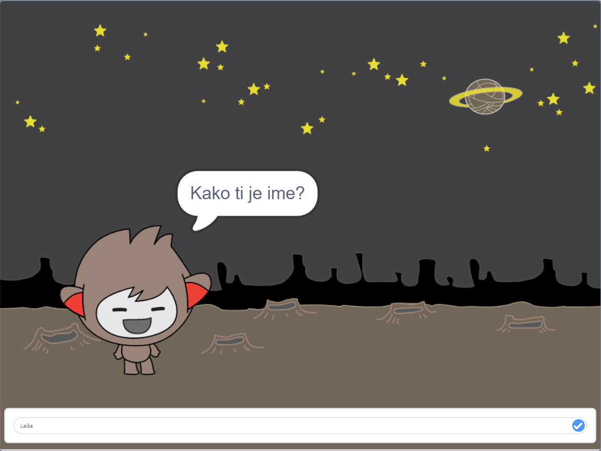

\--- no-print \---

To je **Scratch 3** različica projekta. Obstaja tudi [Scratch 2](https://projects.raspberrypi.org/en/projects/chatbot-scratch2) različica projekta.

\--- /no-print \---

## Uvod

Naučil-a se boš, kako programirati lik, ki se lahko s tabo pogovarja! Tovrsten lik se imenuje robot za klepet ali Čvekobot.

### Kaj boš ustvaril?

\--- no-print \---

Klikni na zeleno zastavico in nato klikini na lik čvekbota, da začneš pogovor. Ko te bo Čvekobot nekaj vprašal, vtipkaj svoj odgovor v polje na dnu odra in nato klikni na modri znak na desni (ali pritisni tipko `enter`), da bo videti Čvekobotov odgovor.

  <iframe allowtransparency="true" width="485" height="402" src="https://scratch.mit.edu/projects/embed/248864190/?autostart=false" 
  frameborder="0" scrolling="no"></iframe>

\--- /no-print \---

\--- print-only \---

\--- /print-only \---

\--- collapse \---

* * *

## title: Kaj boš potreboval?

### Strojna oprema

- Računalnik, ki lahko izvaja Scratch 3

### Programska oprema

- Scratch 3 (bodisi [na spletu](https://rpf.io/scratchon) {: target = "_blank"} ali [brez povezave](https://rpf.io/scratchoff){: target = "_blank)

### Prenosi

- [Tu se nahajajo datoteke za prenos](http://rpf.io/p/en/chatbot-go).

\--- /collapse \---

\--- collapse \---

* * *

## title: Kaj se boš naučil?

- Uporabiti kodo, da združiš nize v Scratchu
- Uporabe spremenljivk za shranjevanje uporabniških vnosov
- Uporabiti pogojen izbor, kot odziv na uporabnikov vnos

\--- collapse \---

* * *

## title: Dodatne informacije za izobraževalce

\--- no-print \---

Če želite natisniti ta projekt, uporabite [tiskalniku prijazno različico](https://projects.raspberrypi.org/en/projects/chatbot/print){:target="_blank"}.

\--- /no-print \---

Dokončan projekt lahko najdete [tukaj](http://rpf.io/p/en/chatbot-get).

\--- /collapse \---