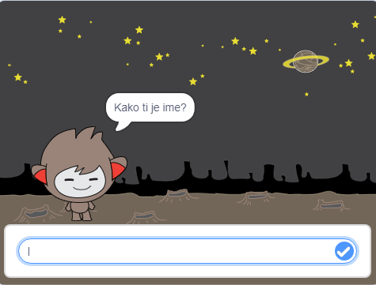
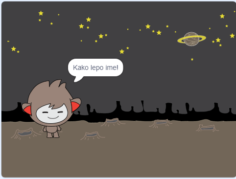
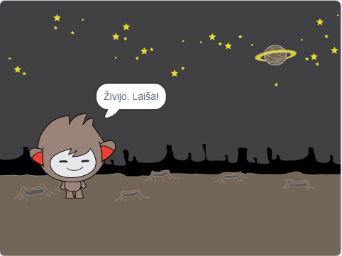

## Govoreči čvekobot

Sedaj, ko imaš klepetalnega robota z osebnostjo, ga sprogramiraj, da se bo pogovarjal s tabo.

--- task ---

Klikni na figuro čvekobota in dodaj to kodo, tako da `ko kliknemo to figuro`{:class="block3events"}, `vpraša za vaše ime`{:class="block3sensing"} in nato `reče: "Kako lepo ime! "`{:class="block3looks"}.


```blocks3
ko kliknemo to figuro
vprašaj [Kako ti je ime?] in počakaj
reci [Kako lepo ime!] za (2) sekund
```

--- /task ---

--- task ---

Klikni na figuro čvekobota, da preizkusiš svojo kodo. Ko te vpraša za ime, ga vnesi v polje, ki se pojavi na dnu odra in nato klikni modro oznako ali pritisni <kbd>Enter</kbd>.





--- /task ---

--- task ---

Za zdaj tvoj klepetalni robot odgovori: "Kako lepo ime!", vsakič, ko odgovoriš. Odgovor robota lahko narediš bolj osebnega, tako da bo odgovor drugačen vsakič, ko vneseš drugo ime.

Spremeni kodo figure čvekobota, tako da `združi`{:class="block3operators"} "Živjo" z `odgovorom`{:class="block3sensing"} na vprašanje: "Kako ti je ime?". Koda mora izgledati takole:


```blocks3
ko kliknemo to figuro
vprašaj [Kako ti je ime?] in počakaj
reci (združi [Živjo, ] (odgovor) :: +) za (2) sekund
```



--- /task ---

--- task ---

Ko shraniš odgovor v **spremenljivko**, ga lahko uporabiš kjerkoli v svojem projektu.

Ustvari novo spremenljivko, ki se bo imenovala `ime`{:class="block3variables"}.

[[[generic-scratch3-add-variable]]]

--- /task ---

--- task ---

Sedaj spremeni kodo za figuro čvekobota, da nastavi spremenljivko `ime`{:class="block3variables"} na `odgovor`{:class="block3sensing"}:


```blocks3
ko kliknemo to figuro
vprašaj [Kako ti je ime?] in počakaj

+ nastavi [ime v] na (odgovor)
reci (združi [Živijo, ] (ime :: variables +)) za (2) sekund
```

Tvoja koda bi morala delovati tako kot prej: tvoj klepetalni robot bi moral reči "Živijo, " in ime, ki je bilo vnešeno.


--- /task ---

Ponovno preizkusi program. Bodi pozoren na to, da je vnešeni odgovor, shranjen v spremenljivki `ime`{:class="block3variables"} in je prikazan tudi v zgornjem levem kotu odra. Da ga skriješ z odra, pojdi na razdelek z bloki `Spremenljivke`{:class="block3variables"} in klikni na kvadratek poleg `imena`{:class="block3variables"} spremenljivke, da ta ni več izbrana.