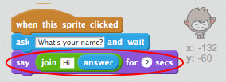

## Pogovorni klepet

Zdaj, ko imate klepet z osebnostjo, programirajte, da se pogovorite z vami.

+ V klepetalnici »chat« dodajte koda, tako da ko jo kliknete, prosi za svoje ime in nato pove: »Kako lepo ime!«
    
    

[[[generic-scratch-saving]]]

\--- namige \--- \--- nasvet \--- Ko je klepet **sprite kliknil**, bi moral za vas ime **vprašati**. Klepetalnica bi nato morala **reči** "Kakšno lepo ime!" \--- / namig \--- \--- namig \--- Tukaj so potrebni kodni bloki:  \--- / hint \--- \--- namig \--- Tukaj naj bo vaša koda videti:  - - / namig \--- \--- / namigi \---

+ Zdaj chatbot preprosto odgovarja "Kakšno lepo ime!" vsakič. Ali lahko svoj odgovor klepete prilagodite tako, da uporabite svoj odgovor?
    
    

\--- namige \--- \--- nasvet \--- Ko je klepet **sprite kliknil**, bi moral za vas ime **vprašati**. Klepetalnica bi morala nato **reči** "Zdravo", ki ji sledi vaš **odgovor**. \--- / namig \--- \--- nasvet \--- Tukaj so bloki kode, ki jih potrebujete:  \--- / hint \--- \--- nasvet \--- Evo, kako naj bo vaša koda videti:  - - / namig \--- \--- / namigi \---

+ Če shranite svoj odgovor v spremenljivko ****, ga lahko kasneje uporabite. Ustvarite novo spremenljivko z imenom `ime` , da shranite svoje ime.

[[[generic-scratch-add-variable]]]

+ Ali lahko svoj odgovor shranite v spremenljivko `` in jo uporabite v odgovoru na klepet?
    
    Vaša koda mora delovati kot prej: vaš chatbot naj pozdravi z vašim imenom.
    
    

\--- namige \--- \--- nasvet \--- Ko je klepet **sprite kliknil**, bi moral za vas ime **vprašati**. Potem morate **nastaviti** spremenljivko `spremenljivko` v svoj **odgovor**. Klepetalnica bi morala nato **reči** "Zdravo", ki ji sledi **ime**. \--- / namig \--- \--- namig \--- Tukaj so bloki kode, ki jih potrebujete:  \--- / hint \--- \--- nasvet \--- Evo, kako naj bo vaša koda videti:  - - / namig \--- \--- / namigi \---

\--- izziv \---

## Izziv: več vprašanj

Programirajte svoj pogovorni klepet, če želite postaviti drugo vprašanje. Ali lahko odgovor shranite v novo spremenljivko?

 \--- / izziv \---