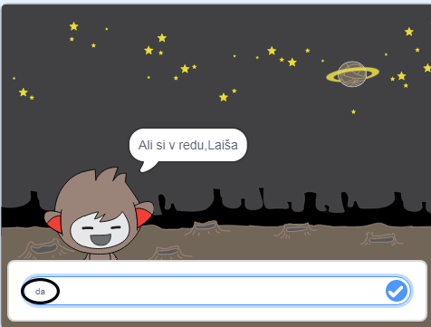
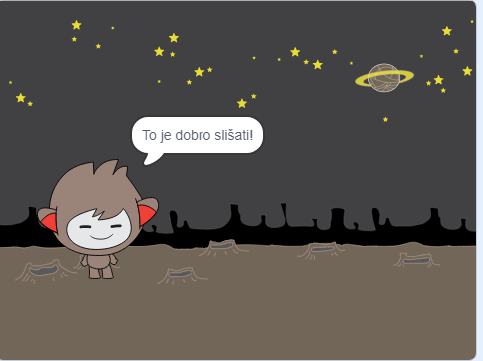
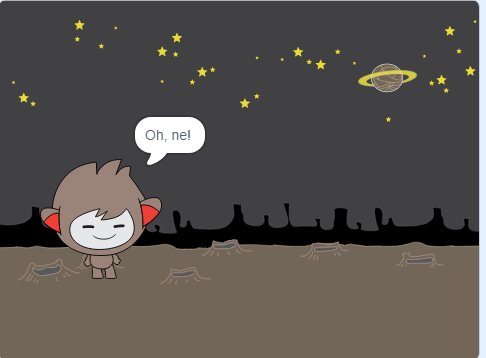
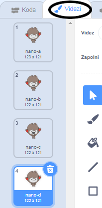
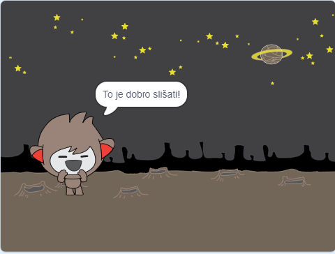
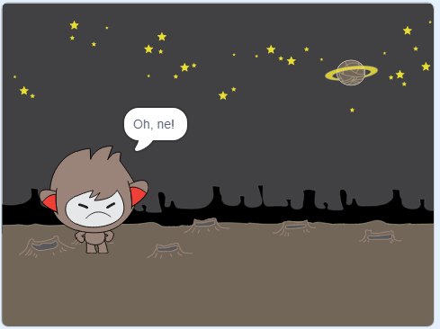
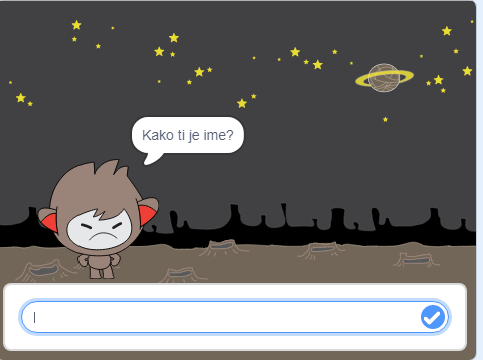
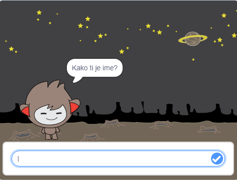

## Sprejemanje odločitev

Čvekobota lahko sprogramiraš tako, da se bo znal odločiti, kaj naj stori, glede na odgovore, ki jih dobi.

Najprej boš naredil, da bo tvoj robot vprašal vprašanje, na katerega se lahko odgovori z "da" ali "ne".

--- task ---

Spremeni kodo čvekobota. Čvekobot naj postavi vprašanje "Ali si v redu, ime", tako da uporabi spremenljivko `ime`{:class="block3variables"}. Na to naj odgovori: "To je dobro slišati!", `če`{:class="block3control"} je odgovor "da", če pa je odgovor "ne", naj ne reče ničesar.






```blocks3
ko kliknemo to figuro
vprašaj [Kako ti je ime?] in počakaj

+ nastavi [ime v] na (odgovor)
reci (združi [Živijo, ] (ime)) za (2) sekund
+ vprašaj (združi [Ali si v redu, ] (ime)) in počakaj
+ če <(odgovor) = [da]> potem 
  reci [To je dobro slišati!] za (2) sekund
konec
```

Kodo sedaj preizkusi **dvakrat**: enkrat z odgovorom "da", in enkrat z odgovorom "ne".

--- /task ---

Trenutno tvoj čvekobot na odgovor "ne", ne reče ničesar.

--- task ---

Spremeni kodo, tako da bo čvekobot odgovoril "Oh, ne!", če prejme "ne" kot odgovor na vprašanje: "Ali si v redu, ime?".

Zamenjaj blok `če, potem`{:class="block3control"} z blokom `če, potem, sicer`{:class="block3control"} in vključi kodo, da bo robot lahko `rekel "Oh, ne!"`{:class="block3looks"}.


```blocks3
ko kliknemo to figuro
vprašaj [Kako ti je ime?] in počakaj
nastavi [ime v] na (odgovor)
reci (združi [Živjo, ] (ime)) za (2) sekund
vprašaj (združi [Ali si v redu, ] (ime)) in počakaj

+ če <(odgovor) = [da]> potem 
  reci [To je lepo slišati!] za (2) sekund
sicer
+ reci [Oh, ne!] za (2) sekund
end
```

--- /task ---

--- task ---

Preveri svojo kodo. Glede na to ali je odgovor "da" ali "ne", bi se moral odziv klepetalnega robota razlikovati: Ob odgovoru "da" (odgovor ne razlikuje malih in velikih črk) mora odgovoriti "To je dobro slišati!", **sicer** pa odgovori "Oh, ne!".




--- /task ---

Znotraj bloka `če, potem, sicer`{:class="block3control"} lahko imaš poljubno kodo, ne le kode, ki omogoča, da tvoj robot govori!

Če klikneš na zavihek **Videzi** figure Čvekobota, boš videl-a, da ima figura več videzov.



--- task ---

Spremeni kodo čvekobota, da bo robot menjal videz, ko vneseš odgovor.





Spremeni kodo znotraj bloka `če, potem, sicer`{:class="block3control"} v `zamenjaj videz`{:class="block3looks"}.


```blocks3
ko kliknemo to figuro
vprašaj [Kako ti je ime?] in počakaj

nastavi [ime v] na (odgovor)
reci (združi [Živijo, ] (ime)) za (2) sekund
vprašaj (združi [Ali si v redu, ] (ime)) in počakaj
če <(odgovor) = [da]> potem 

+ zamenjaj videz na (nano-c v)  
reci [To je lepo slišati!] za (2) sekund
sicer
+ zamenjaj videz na (nano- d v)
  reci [Oh, ne!] za (2) sekund
konec
```

Preveri in shrani svojo kodo. Obraz tvojega čvekobota bi se sedaj moral spreminjati glede na odgovor.

--- /task ---

Ali si opazil, da se videz čvekobota, po zamenjavi videza, ne spremeni nazaj v začetni videz, temveč ostane spremenjen?

Lahko poskusiš to: zaženi kodo in odgovori z "ne", da se bo obraz tvojega robota spremenil v nesrečen pogled. Nato znova zaženi kodo in opazil boš, da čvekobot, preden te vpraša za ime, ne postane spet vesel.



--- task ---

Da bi odpravil to težavo, dodaj kodi klepetalnega robota `zamenjaj videz`{:class="block3looks"} takoj za začetnim blokom `ko kliknemo to figuro`{:class="block3events"}.


```blocks3
ko kliknemo to figuro

+ zamenjaj videz na (nano-a v)
vprašaj [Kako ti je ime?] in počakaj
```



--- /task ---