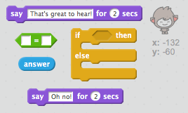
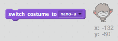
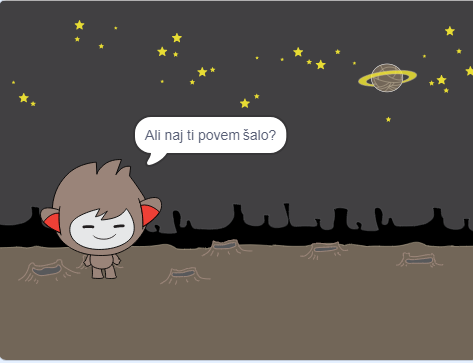

## 3. korak: sprejemanje odločitev

Program chatbot lahko programirate tako, da se odločite, kaj želite povedati ali storiti na podlagi odgovorov na vprašanja.

+ Ali lahko klepetalnico zastavi vprašanje »Ali ste v redu?« In kodo odgovorite »To je super slišati!« samo **, če uporabnik odgovori »da«**?
    
    Če želite pravilno preizkusiti novo kodo, jo morate preskusiti **dvakrat**, enkrat z odgovorom "da" in enkrat z odgovorom "ne".
    
    Vaš chatbot bi moral odgovoriti: "To je super, da slišiš!" če odgovorite "da", vendar ne odgovorite nič, če odgovorite "ne".
    
    

\--- namige \--- \--- nasvet \--- Po tem, ko je tvoj chatbot povedal, "Zdravo", bi moral zdaj tudi **vprašati** "Ste v redu?". **Če** odgovorite z "da", potem chatbot mora **reči** "To je super slišati!". \--- / namig \--- \--- namig \--- Tukaj so dodatni koda bloki, ki jih potrebujete:  \--- / hint \--- \--- namig \--- Evo, kako naj bo vaša koda videti:  \--- / namig \--- \--- / namigi \---

+ Trenutno vaš klepet ne pove ničesar, če odgovorite "ne". Ali lahko spremenite svojo chatbot tako, da bo odgovoril tudi "Oh ne!" če odgovorite na vprašanje "ne"?
    
    Preizkusite in shranite. Vaš chatbot bi zdaj moral reči "Oh ne!" če odgovorite "ne". Pravzaprav bo rekel "Na ne!" če odgovorite z nečim drugim, kot je "da" ( **drugo** v `if / else` blok pomeni **drugače**).
    
    

\--- namig \--- \--- nasvet \--- Vaš chatbot bi zdaj moral reči: "To je super slišati!" **če je** tvoj odgovor "da", ampak bi moral reči "Oh ne!" če odgovorite na kaj **drugo**. \--- / namig \--- \--- namig \--- Tukaj so bloki kode, ki jih boste morali uporabiti:  \--- / hint \--- \--- namig \--- Evo, kako naj bo vaša koda videti:  \--- / namig \--- \--- / namigi \---

+ Lahko vnesete poljubno kodo v `if / else` blok, ne samo kodo, da bi vaš chatbot govoril. Če kliknete zavihek **kostum** v klepetu v klepetu, boste videli, da ima več kot en kostum.
    
    

+ Ali lahko spremenite kostum klepetalnice, da ustreza vašemu odzivu?
    
    Preizkusite in shranite. Videti morate, da se obraz vašega klepeta spremeni glede na vaš odgovor.
    
    

\--- nasveti \--- \--- nasvet \--- Vaš chatbot zdaj mora tudi **preklopiti kostum** odvisno od odgovora. \--- / namig \--- \--- nasvet \--- Tukaj so bloki kode, ki jih boste morali uporabiti:  \--- / hint \--- \--- namig \--- Tukaj naj bo vaša koda videti:  \--- / namig \--- \--- / namigi \---

+ Ste opazili, da kostum klepeta ostaja enak, da se je to spremenilo, ko ste nazadnje govorili z njim? Ali lahko odpravite to težavo?
    
    
    
    Preizkusite in shranite: zaženite kodo in vnesite »ne«, tako da vaš klepet ne bo zadovoljen. Ko znova zaženete kodo, se mora pogovorno okno spremeniti nazaj na nasmejan obraz, preden vprašate svoje ime.
    
    

\--- namige \--- \--- nakazovanje \--- Ko kliknete **sprite**, bi moral klepetalniku najprej preklopiti kostum **** na nasmejan obraz. \--- / namig \--- \--- nasvet \--- Tukaj je kodni blok, ki ga boste morali dodati:  \--- / hint \--- \--- namig \--- Evo, kako naj bo vaša koda videti:  \--- / namig \--- \--- / namigi \---

\--- izziv \---

## Izziv: več odločitev

Programirajte svoj pogovorni klepet, če želite postaviti drugo vprašanje - nekaj z odgovorom »da« ali »ne«. Ali lahko klepetate odgovorite na odgovor?

 \--- / izziv \---