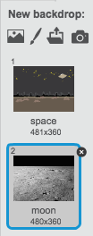
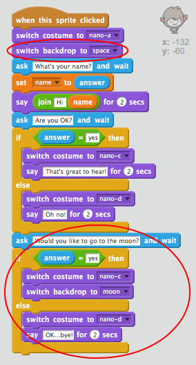

## Spreminjanje lokacije

Kodo lahko tudi kodirate, da spremenite svojo lokacijo.

+ Dodajte še eno ozadje v svojo stopnjo, na primer ozadje lune.
    
    

+ Ali lahko klepetate svojo klepetalnico vprašati: "Ali bi radi šli na Luno?" in nato spremenite lokacijo, če odgovorite na "da"?
    
    Preizkusite in shranite. Če odgovorite z "da", bi moral vaš klepet spremeniti lokacijo. Vaš klepet bi moral videti žalostno in reči "OK ... zdravo!" če je drug odgovor.
    
    

\--- namige \--- \--- nasvet \--- Vaš chatbot bi moral **vprašati** "Želite iti na mesec?". **Če je vaš 123_8_1_321 odgovor **odgovor** "da", potem bi moral vaš klepet **spremeniti kostum** , da bi bil videti srečen in stopnjo **ozadje** spremeniti.
 

Če odgovorite na "ne", mora klepetalnica **spremeniti kostum** , da bo videti žalostno in **reči** "OK ... bye!"

Prav tako boste morali dodati kodo, da začnete pogovorno okno na pravem mestu **, ko kliknete**. \--- / namig \--- \--- namig \--- Tukaj so bloki kode, ki jih boste morali uporabiti:  \--- / hint \--- \--- namig \--- Evo, kako naj bo vaša koda videti:  \--- / namig \--- \--- / namigi \---

+ Ali lahko dodate kodo, da bi vaš klepetalnico skočil iz radosti, če mu poveste, da želite iti na Luno?
    
    Preizkusite in shranite. Če odgovorite s »da«, bi moral vaš klepet skočiti navzgor in navzdol. Vaš chatkot ne bi smel skočiti, če je podan noben drug odgovor.
    
    

\--- namige \--- \--- nasvet \--- Vaš klepet bi moral skočiti s **spreminjanjem** svojo **y položaj** za majhno količino in nato spremeniti svoj položaj nazaj po kratkem **čakati**. Morda boste želeli **ponoviti** to nekajkrat. \--- / namig \--- \--- namig \--- Tukaj so bloki kode, ki jih boste morali uporabiti:  \--- / hint \--- \--- namig \--- Evo, kako naj bo vaša koda videti:  \--- / namig \--- \--- / namigi \---