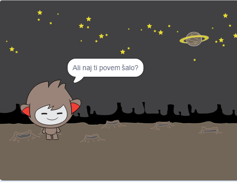

## Izziv: več odločitev

Programiraj svoj klepetalni robot, da postavi drugo vprašanje, katerega odgovor je lahko "da" ali "ne". Ali lahko narediš, da se bo robot odzval drugače, odvisno od tega, kateri odgovor prejme?

