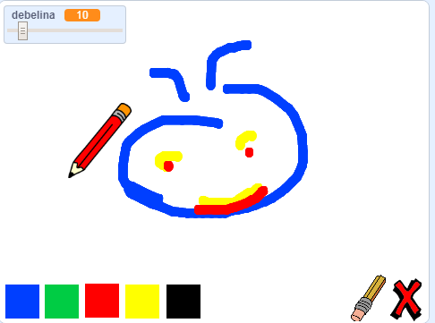

## Kaj sledi?

Preizkusi projekt [Barvice](https://projects.raspberrypi.org/en/projects/paint-box?utm_source=pathway&utm_medium=whatnext&utm_campaign=projects), v katerem boš ustvaril svoj lastni risarski program!

--- no-print ---

Za začetek klikni na zeleno zastavico. Uporabi miško za premikanje svinčnika in drži levo tipko miške za risanje. Klikni na barvo, da zamenjaš barvo. Klikni na radirko, da jo izbereš in jo uporabiš za brisanje. Če želiš pobrisati cel list, klikni na križec.

  <iframe allowtransparency="true" width="485" height="402" src="//scratch.mit.edu/projects/embed/267243161/?autostart=false" frameborder="0" scrolling="no"></iframe>
  

--- /no-print ---

--- print-only ---

Zaženi program s klikom na zeleno zastavico in uporabi miško za premikanje svinčnika. Drži levo tipko miške za risanje. Če klikneš na barvo, se bo spremenila barva svinčnika, klik na radirko pa bo izbral radirko!

--- /print-only ---

***

Ta projekt so prevedli prostovoljci:

Arnold Marko

Zahvaljujoč prostovoljcem, lahko ljudem po vsem svetu omogočimo, da se učijo v svojem jeziku. S prostovoljnim prevajanjem nam lahko pomagate, da dosežemo več ljudi - več informacij na [rpf.io/translate](https://rpf.io/translate).