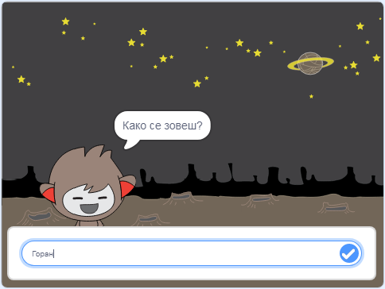

\--- no-print \---

Ово је **Scratch 3** верзија пројекта. Постоји, такође, и [Scratch 2 верзија пројекта](https://projects.raspberrypi.org/en/projects/chatbot-scratch2).

\--- /no-print \---

## Увод

Научићеш како да програмираш лика који може да разговара са тобом! Такав лик се назива робот који разговара.

### Шта ћеш направити

\--- no-print \---

Кликни на зелену заставицу, а затим кликни на робота који разговара да започнеш разговор. Када робот постави питање, откуцај твој одговор у поље на дну Позорнице, а затим кликни на плаву ознаку на десној страни (или притисни `Enter`) да видиш одговор робота.

  <iframe allowtransparency="true" width="485" height="402" src="https://scratch.mit.edu/projects/embed/248864190/?autostart=false" 
  frameborder="0" scrolling="no"></iframe>

\--- /no-print \---

\--- print-only \---

\--- /print-only \---

\--- collapse \---

* * *

## title: Шта ће ти бити потребно

### Хардвер

- Рачунар који може да покрене Scratch 3

### Софтвер

- Scratch 3 ([на мрежи](https://rpf.io/scratchon) или [ван мреже](https://rpf.io/scratchoff))

### Преузимање

- [Овде пронађи датотеке за преузимање](http://rpf.io/p/en/chatbot-go).

\--- /collapse \---

\--- collapse \---

* * *

## title: Шта ћеш научити

- Use code to concatenate strings in Scratch
- Know that variables can be used to store user input
- Use conditional selection to respond to user input in Scratch \--- /collapse \---

\--- collapse \---

* * *

## title: Додатне информације за наставнике

\--- no-print \---

Уколико желите да одштампате овај пројекат, молимо Вас користите [верзију за штампање](https://projects.raspberrypi.org/en/projects/chatbot/print){:target="_blank"}.

\--- /no-print \---

Завршени пројекат можете пронаћи [овде](http://rpf.io/p/en/chatbot-get).

\--- /collapse \---