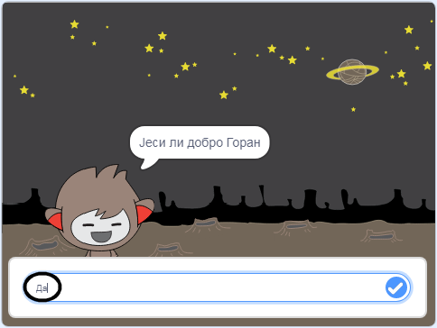
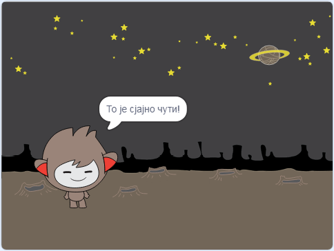
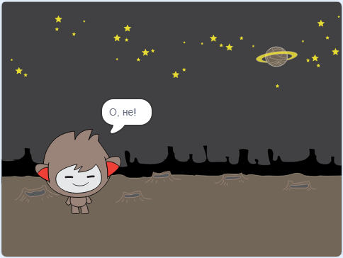
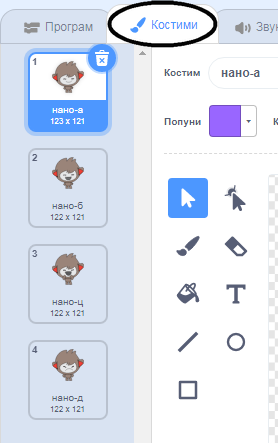
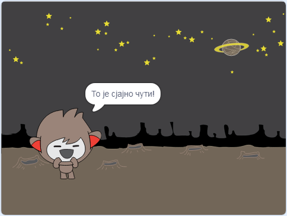
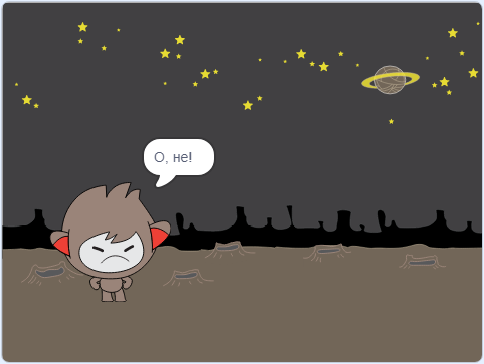
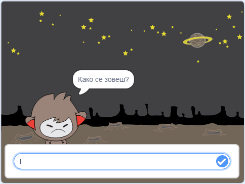
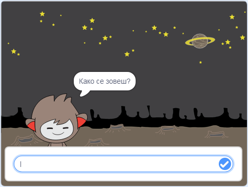

## Доношење одлука

Можеш да програмираш робота да одлучи шта ће урадити на основу одговора које добије.

Прво ћеш направити да твој робот постави питање на које се може одговорити са "да" или "не".

\--- task \---

Промени код свог робота. Твој робот би требао да постави питање "Јеси ли добро ", користећи променљиву `име`{:class="block3variables"}. Then it should reply "That's great to hear!" `if`{:class="block3control"} the answer it receives is "yes", but say nothing if the answer is "no".






```blocks3
када је кликнуто на овај лик
питај [Како се зовеш?] и чекај
нека [име v] буде (одговор)
изговори (споји [Здраво ] и (име)) током (2) секунде
+питај (споји [Јеси ли добро ] и (име)) и чекај
+ако је <(одговор) = [да]> онда 
  изговори [То је сјајно чути!] током (2) секунде
end
```

To test your new code properly, you should test it **twice**: once with the answer "yes", and once with the answer "no".

\--- /task \---

At the moment, your chatbot doesn't doesn't say anything to the answer "no".

\--- task \---

Change your chatbot's code so that it replies "Oh no!" if it receives "no" as the answer to "Are you OK name".

Replace the `if, then`{:class="block3control"} block with an `if, then, else`{:class="block3control"} block, and include code so the chatbot can `say "Oh no!"`{:class="block3looks"}.


```blocks3
када је кликнуто на овај лик
питај [Како се зовеш?] и чекај
нека [име v] буде (одговор)
изговори (споји [Здраво ] и (име)) током (2) секунде
питај (споји [Јеси ли добро ] и (име)) и чекај

+ ако је <(одговор) = [да]> онда 
  изговори [То је сјајно чути!] током (2) секунде
у супротном 
+  изговори [О, не!] током (2) секунде
end
```

\--- /task \---

\--- task \---

Испробај свој код. You should get a different response when you answer "no" and when you answer "yes": your chatbot should reply with "That’s great to hear!" when you answer "yes" (which is not case-sensitive), and reply with "Oh no!" when you answer **anything else**.




\--- /task \---

You can put any code inside an `if, then, else`{:class="block3control"} block, not just code to make your chatbot speak!

If you click your chatbot's **Costumes** tab, you'll see that there is more than one costume.



\--- task \---

Change your chatbot's code so that the chatbot switches costumes when you type in your answer.





Change the code inside the `if, then, else`{:class="block3control"} block to `switch costume`{:class="block3looks"}.


```blocks3
када је кликнуто на овај лик
питај [Како се зовеш?] и чекај
нека [име v] буде (одговор)
изговори (споји [Здраво ] и (име)) током (2) секунде
питај (споји [Јеси ли добро ] и (име)) и чекај
ако је <(одговор) = [да]> онда 

+  замени костим са (нано-ц v)
  изговори [То је сјајно чути!] током (2) секунде
у супротном 
+  замени костим са (нано-д v)
  изговори [О, не!] током (2) секунде
end
```

Test and save your code. You should see your chatbot's face change depending on your answer.

\--- /task \---

Have you noticed that, after your chatbot's costume has changed, it stays like that and doesn't change back to what it was at the beginning?

You can try this out: run your code and answer "no" so that your chatbot's face changes to an unhappy look. Then run your code again and notice that your chatbot does not change back to looking happy before it asks your name.



\--- task \---

To fix this problem, add to the chatbot's code to `switch costume`{:class="block3looks"} at the start `when the sprite is clicked`{:class="block3events"}.


```blocks3
када је кликнуто на овај лик

+ замени костим са (нано-а v)
питај [Како се зовеш?] и чекај
```



\--- /task \---