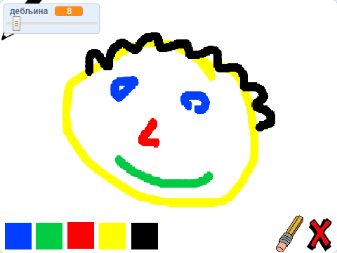

## Шта даље?

Испробај пројекат [Програм за цртање](https://projects.raspberrypi.org/en/projects/paint-box?utm_source=pathway&utm_medium=whatnext&utm_campaign=projects), где ћеш направити сопствени програм за цртање!

--- no-print --- Кликни на зелену заставицу да почнеш. Користи миш да помераш оловку и држи притиснут леви тастер миша да црташ. Кликни на боју да промениш бојице. Кликни на гумицу да је употребиш да обришеш свој рад. Да обришеш страницу, кликни на крстић.

  <iframe allowtransparency="true" width="485" height="402" src="//scratch.mit.edu/projects/embed/267243161/?autostart=false" frameborder="0" scrolling="no"></iframe>
  

--- /no-print ---

--- print-only --- Можеш кликнути на зелену заставицу да почнеш. Употреби миш како би померао оловку и држи притиснут десни тастер миша да црташ. Кликом на боју промениће се боја бојице, а кликом на гумицу појавиће се гумица!

 --- /print-only ---
