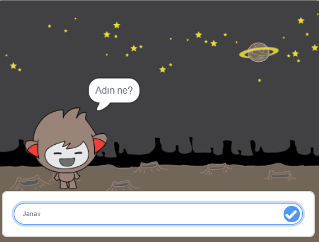

\--- no-print \---

Bu, projenin **Scratch 3** sürümüdür. Projenin aynı zamanda [Scratch 2 sürümü](https://projects.raspberrypi.org/en/projects/chatbot-scratch2) de vardır.

\--- /no-print \---

## Giriş

Sizinle konuşabilecek bir karakteri nasıl programlayacağınızı öğreneceksiniz! Bunun gibi bir karaktere sohbet robotu veya sohbetçi denir.

### Ne yapacaksınız

\--- no-print \---

Yeşil bayrağa tıklayın ve sohbete başlamak için sohbet karakteri üzerine tıklayın. Sohbetçi bir soru sorduğunda cevabınızı Sahne Alanı'nın altındaki kutuya yazın ve ardından sohbetçinin cevabını görmek için sağdaki mavi işarete tıklayın (veya `Enter`basın).

  <iframe allowtransparency="true" width="485" height="402" src="https://scratch.mit.edu/projects/embed/248864190/?autostart=false" 
  frameborder="0" scrolling="no"></iframe>

\--- /no-print \---

\--- print-only \---

\--- /print-only \---

\--- collapse \---

* * *

## İhtiyacınız olacak şeyler

### Donanım

- Scratch 3'ı çalıştırabilen bilgisayar

### Yazılım

- Scratch 3 ( [online](https://rpf.io/scratchon) ya da [offline](https://rpf.io/scratchoff))

### İndirilenler

- [Buradan indirilecek dosyaları bulun](http://rpf.io/p/en/chatbot-go).

\--- /collapse \---

\--- collapse \---

* * *

## title: Ne öğreneceksiniz

- Use code to concatonate strings in Scratch
- Know that variables can be used to store user input
- Use conditional selection to respond to user input in Scratch \--- /collapse \---

\---collapse\---

* * *

## title: Eğitimciler için ek notlar

.

Bu projeyi yazdırmanız gerekiyorsa lütfen [yazıcı-dostu sürümü](https://projects.raspberrypi.org/en/projects/chatbot/print){:target="_blank"} kullanın.

.

You can find the [completed project here](http://rpf.io/p/en/chatbot-get).

\--- /collapse \---