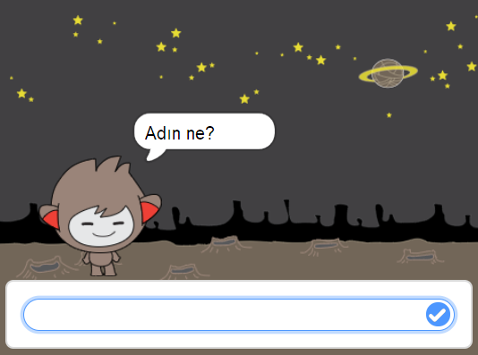
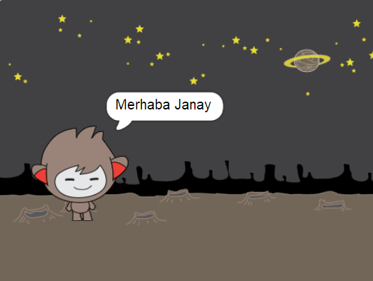

## Konuşan bir chatbot

Artık, kişiliğe sahip bir sohbetçi var, bunu seninle konuşması için programlayacaksın.

\--- task \---

Chatbot sprite seçeneğine tıklayın ve bu kodu,</code>{: class = "block3events"} tıklandığında `, <code>isminiz`{: class = "block3sensing"} ve ardından `"Ne bir sevimli isim!"`{: class = "block3looks"}.


```blocks3
bu sprite tıklandığında
[? Adın nedir] sormak ve bekleyin
[Ne güzel bir isim!] demek (2) saniye
```

\--- /görev \---

\--- task \---

Kodunuzu test etmek için sohbet çubuğuna tıklayın. Sohbetçi adınızı isterse, Sahne Alanı'nın altında görünen kutuya yazın ve ardından mavi işarete tıklayın veya <kbd>Enter</kbd>basın.




\--- /görev \---

\--- task \---

Şu anda, chatbot cevap verir "Ne güzel bir isim!" Her cevap verdiğinde. Sohbet aracının yanıtını daha kişisel hale getirebilirsiniz, böylece farklı bir ad yazıldığında yanıt farklı olur.

Chatbot sprite kodunu `değiştirin`: {: class = "block3operators"} "Merhaba" `cevabı`{: class = "block3sensing"} ile "Adın ne?" soru, böylece kod şöyle görünür:


```blocks3
bu sprite tıklandığında
[? Adın nedir] sormak ve bekleyin
söz (katılmak [Merhaba] (cevap) :: +) (2) saniye
```



\--- /task \---

\--- task \---

Yanıtı **değişkeninde**depolayarak, projenizin herhangi bir yerinde kullanabilirsiniz.

`name`adında yeni bir değişken oluşturun. {: Class = "block3variables"}.

[[[generic-scratch3-add-variable]]]

\--- /task \---

\--- task \---

Şimdi, chatbot sprite kodunu değiştirerek `name`{: class = "block3variables"} değişkenini `answer`{: class = "block3sensing"} olarak ayarlayın:


```blocks3
bu sprite
tıklandığında sorulduğunda [adın ne?] ve

+ bekle [ad v] 'i (cevapla)
söyle ([Hi] (name :: değişkenler +)' a (2) saniye boyunca katıl
```

Kodunuz eskisi gibi çalışmalıdır: chatbot yazdığınız adı kullanarak merhaba demelidir.


\--- /görev \---

Programınızı tekrar test edin. Yazdığınız cevabın `{`class: "=" block3variables "} değişkeninde saklandığına ve ayrıca Sahne Alanı'nın sol üst köşesinde de bulunduğuna dikkat edin. To make it disappear from the Stage, go to the `Variables`{:class="block3variables"} blocks section and click on the box next to `name`{:class="block3variables"} so that it is not marked.