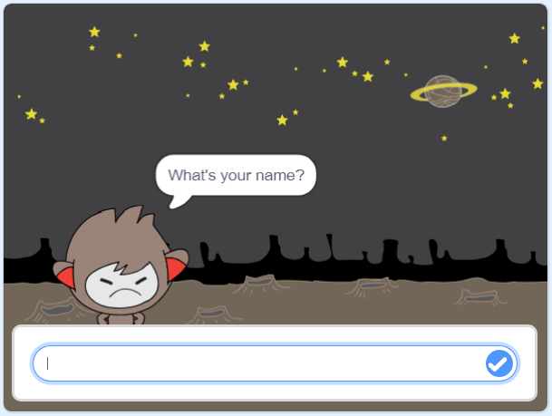

## Karar vermek

Chatbotunuzu, aldığı cevaplara göre ne yapacağınıza karar verecek şekilde programlayabilirsiniz.

Öncelikle, chatbot'unuzun "evet" veya "hayır" ile cevaplanabilecek bir soru sormasını sağlayacaksınız.

\--- task \---

Sohbet aracınızın kodunu değiştirin. Sohbet aracınız, `adını`{: class = "block3variables"} değişkenini kullanarak, "İyi misiniz?" Sonra cevap vermeli "Bu duymak harika!" `eğer`{: class = "block3control"} aldığı cevap "evet" dir, fakat cevap "hayır" ise hiçbir şey söylemeyin.


```blocks3
bu sprite tıklandığında
[? Adın nedir] sormak ve bekleyin
(cevap) için set [isim v]
söz hakkından (katılmak [Merhaba] (isim)) (2) saniye boyunca
+ sormak (katılmak [size Tamam mı] (isim)) ve
+ bekleyin eğer <(cevap) = [yes]> sonra 
  (2) saniye boyunca [duymak harika!] deyin

```

Yeni kodunuzu doğru şekilde test etmek için, **kez iki kez**: bir kez "evet", bir kez de "hayır" cevabını test etmelisiniz.

\--- /task \---

Şu anda, chatbotunuz "hayır" cevabına hiçbir şey söylemiyor.

\--- task \---

Sohbet kameranızın kodunu değiştirerek "Ah hayır!" "Hayır" isminin cevabı olarak "hayır" alırsa.

Değiştir `, sonra`bir blok: {class = "block3control"} `, sonra başka`{: class = "block3control"} Chatbot can böylece blok ve kod içeren `demek "Oh hayır!"`{: class = "block3looks"}.


```blocks3
bu sprite
tıklandığında sormak [adın ne?] ve
set bekle [ad v] 'a (cevap)
söyle ([merhaba] (ad)) için (2) saniye bekle
sor (katıl [iyi misin]) ( adı)) ve bekleyin

+ eğer <(cevap) = [yes]> ardından 
  [Bunu duymak harika!] demek (2) saniye boyunca
başka 
+ [hayır!] (2) saniye boyunca say
ucunda
```

\--- /task \---

\--- task \---

Kodunu test et. "Hayır" cevabını verdiğinizde ve "evet" cevabını verdiğinizde farklı bir yanıt almalısınız: sohbetiniz "Bu duymak harika!" "evet" (büyük küçük harf duyarlı değildir) ve "Ah hayır!" **yanıtladığınızda başka bir şey**.


\--- /task \---

`içindeki herhangi bir kodu koyarsanız, o zaman, aksi halde`{: class = "block3control"} bloğunu, sadece chatbot'unuzun konuşmasını sağlayacak kod değil!

Sohbetbotunuzun **Kostüm** sekmesini tıklarsanız, birden fazla kostüm olduğunu göreceksiniz.


\--- task \---

Sohbet kodunuzun kodunu değiştirin, böylece sohbet yazın, cevabınızı yazdığınızda kostümleri değiştirir.


Eğer `ise içindeki kodu değiştirin, sonra`: {: class = "block3control"} bloğu `anahtar kostümü`{: class = "block3looks"}.


```blocks3
bu sprite
tıklandığında sormak [adın ne?] ve
set bekle [ad v] 'a (cevap)
söyle ([merhaba] (ad)) için (2) saniye bekle
sor (katıl [iyi misin]) ( isim)) ve
bekleyin eğer <(cevap) = [yes]> sonra 

+ kılık değiştir (nano-c v)
  diyor ki (2) saniye boyunca [duymak çok güzel!]
saniye 
+ kılık değiştir (nano- d v)
  (2) saniye için

```

Kodunuzu test edin ve kaydedin. Cevabınıza bağlı olarak chatbot'un yüzünün değiştiğini görmelisin

\--- /task \---

Sohbet kameranızın kostümü değiştikten sonra, öyle kaldığını ve başlangıçta ne olduğuna dönmediğini fark ettiniz mi?

Bunu deneyebilirsiniz: kodunuzu çalıştırın ve "hayır" cevabını verin, böylece sohbetçinizin yüzü mutsuz bir görünüme dönüşür. Ardından kodunuzu tekrar çalıştırın ve adınız sormadan önce sohbetinizin tekrar mutlu görünmediğini unutmayın.



\--- task \---

Bu sorunu çözmek için sprite</code>{: class = "block3events"} tıklandığında chatbot koduna `anahtar kostümü`{: class = "block3looks"} 'a (başlangıç `ekleyin.</p>

<p></p>

<pre><code class="blocks3">Bu sprite,

+ kostümü tıklattığında (nano-a v)
sor. [Adın ne?] sor ve bekle.
`</pre> 


\--- /task \---