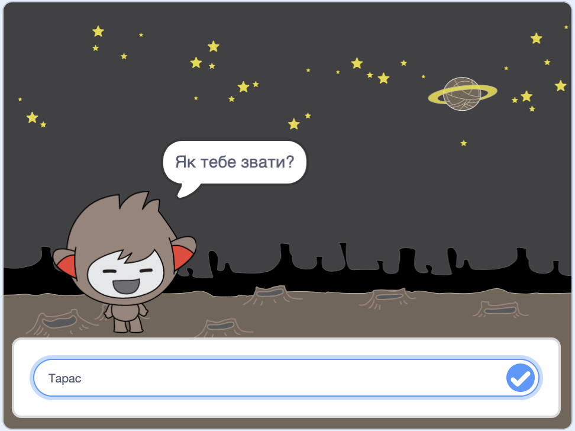

\--- no-print \---

Це — версія проєкту для **Скретч 3**. Також існує [версія проєкту для Скретч 2](https://projects.raspberrypi.org/en/projects/chatbot-scratch2).

\--- /no-print \---

## Вступ

Ти дізнаєшся, як запрограмувати персонажа, який може з тобою говорити! Такого персонажа називають чат-роботом або чат-ботом.

### Що ти зробиш

\--- no-print \---

Натисни на зелений прапорець, а потім на персонажа чат-бота, щоб розпочати розмову. Коли чат-бот поставить запитання, введи свою відповідь у поле в нижній частині Сцени та клацни на синю позначку праворуч (або натисни `Enter`), щоб побачити відповідь чат-бота.

  <iframe allowtransparency="true" width="485" height="402" src="https://scratch.mit.edu/projects/embed/248864190/?autostart=false" 
  frameborder="0" scrolling="no"></iframe>

\--- /no-print \---

\--- print-only \---

\--- /print-only \---

## \--- collapse \---

## title: Що тобі знадобиться

### Обладнання

- Комп'ютер, що підтримує Скретч 3

### Програмне забезпечення

- Скретч 3 ([онлайн](https://rpf.io/scratchon) або [офлайн](https://rpf.io/scratchoff))

### Завантаження

- [Знайди файли для завантаження тут](http://rpf.io/p/en/chatbot-go).

\--- /collapse \---

## \--- collapse \---

## title: Чого ти навчишся

- Use code to join text in Scratch
- Дізнаєшся, що змінні можуть використовуватися для зберігання вводу від користувача
- Використовувати розгалуження, щоб реагувати на ввід користувача у Скретч

\--- /collapse \---

## \--- collapse \---

## title: Додаткові примітки для викладачів

\--- no-print \---

Якщо вам потрібно роздрукувати цей проєкт, будь ласка, скористайтеся [версією для друку](https://projects.raspberrypi.org/en/projects/chatbot/print){:target="_ blank"}.

\--- /no-print \---

Ви можете знайти [завершений проєкт тут](http://rpf.io/p/en/chatbot-get).

\--- /collapse \---