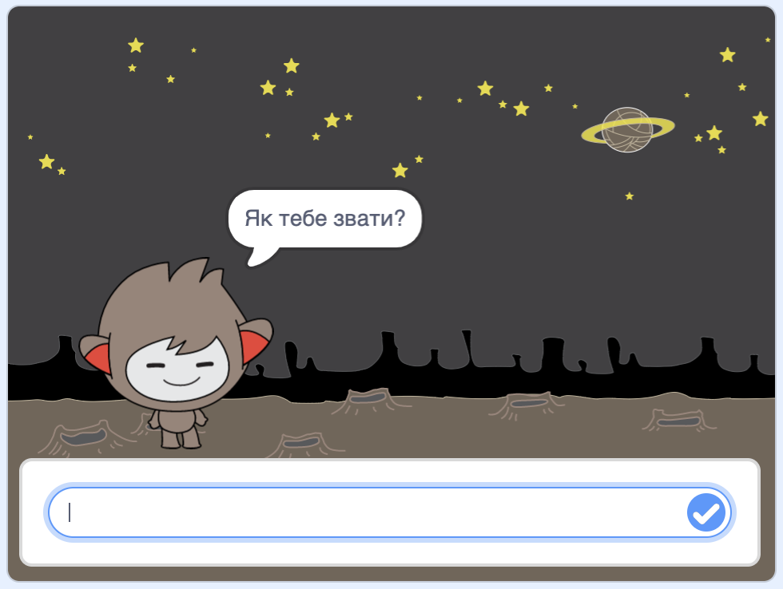
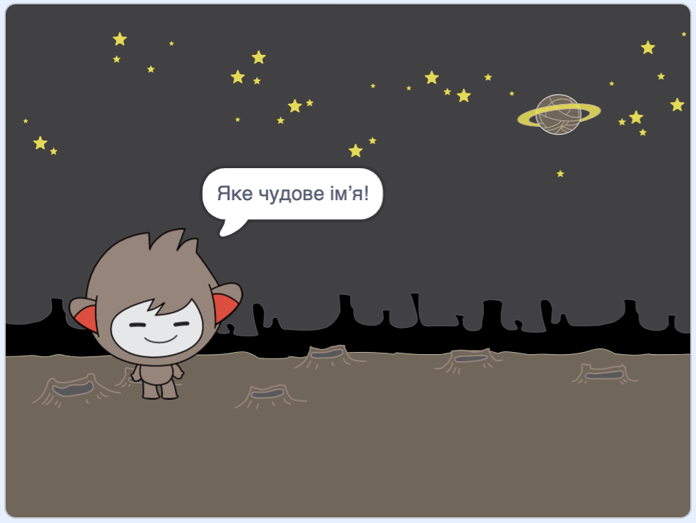
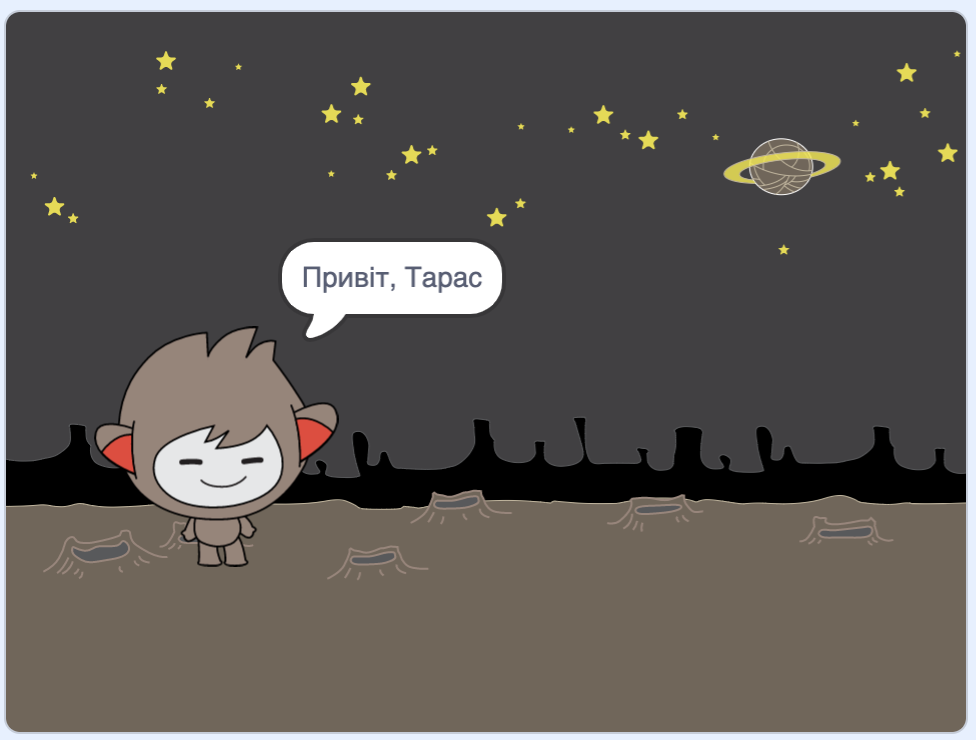

## Чат-бот, що розмовляє

Тепер, коли у тебе є персонаж чат-бота, давай запрограмуємо його розмовляти з тобою.

\--- task \---

Натисни на свій спрайт чат-бота і додай до нього цей код, щоб `коли цей спрайт натиснуто`{:class="block3events"}, він `запитував твоє ім'я`{:class="block3sensing"}, а потім `говорив: "Яке чудове ім'я!"`{:class="block3looks"}.


```blocks3
when this sprite clicked
ask [What's your name?] and wait
say [What a lovely name!] for (2) seconds
```

\--- /task \---

\--- task \---

Клацни на свого чат-бота, щоб протестувати свій код. Коли бот запитає твоє ім’я, введи його в поле внизу Сцени, а далі клацни на синю позначку або натисни <kbd>Enter</kbd>.





\--- /task \---

\--- task \---

Зараз твій чат-бот відповідає "Яке чудове ім’я" після кожного твого вводу. Ти можеш зробити відповідь бота більш персоналізованою так, щоб ця відповідь була іншою кожного разу, коли вводиться нове ім’я.

Зміни код спрайта чат-бота, щоб `з’єднати`{:class="block3operators"} "Привіт," з `відповіддю`{:class="block3sensing"} на питання "Як тебе звати?", де код виглядає таким чином:


```blocks3
when this sprite clicked
ask [What's your name?] and wait
say (join [Hi ] (answer) :: +) for (2) seconds
```



\--- /task \---

\--- task \---

Зберігаючи відповідь у **змінній**, ти можеш використовувати її в будь-якому місці свого проєкту.

Створи змінну з назвою `ім’я`{:class="block3variables"}.

[[[generic-scratch3-add-variable]]]

\--- /task \---

\--- task \---

Тепер зміни код спрайта чат-бота, щоб встановити значення змінної `ім’я`{:class="block3variables"} рівному `відповіді`{:class="block3sensing"}:


```blocks3
when this sprite clicked
ask [What's your name?] and wait

+ set [name v] to (answer)
say (join [Hi ] (name :: variables +)) for (2) seconds
```

Твій код має працювати так само як і раніше: твій чат-бот має привітатися, використовуючи введене тобою ім’я.


\--- /task \---

Протестуй програму знову. Зверни увагу, що введена відповідь зберігається у змінній `ім’я`{:class="block3variables"} і відображається у верхньому лівому куті Сцени. To make it disappear from the Stage, go to the `Variables`{:class="block3variables"} blocks section and click on the box next to `name`{:class="block3variables"} so that it is not marked.