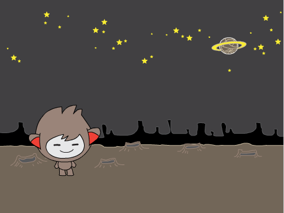

## Ваш чат-бот

\--- task \---

Перш ніж почати розробку вашого чат-бота, вам потрібно подумати над його особистістю. ** Подумайте про наступні питання**:

    + Як їх звуть? 
    + Де вони живуть? 
    + Вони щасливі? Серйозні? Смішні? Сором'язливі? Дружні?
    

\--- /task \---

\--- task \---

Відкрийте новий порожній проект Scratch.

[[[generic-scratch-new-project]]]

\--- /task \---

\--- task \---

Виберіть один із цих символів і додайте їх до вашого проекту:

[[[generic-scratch-sprite-from-library]]]

\--- /task \---

\--- task \---

Choose a backdrop that fits your chatbot's personality. Here's an example, although yours doesn't have to look like this:

[[[generic-scratch-backdrop-from-library]]]

\--- /task \---

\--- task \---

Save your project.

[[[generic-scratch-saving]]]

\--- /task \---