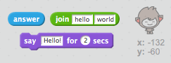

## Чат-бот, що розмовляє

Тепер, коли у вас є чат-бот з особистістю, давайте запрограмуємо його розмовляти з вами.

\--- task \---

Додайте до вашого чат-боту код, щоб після натискання, він запитував ваше ім'я, а потім казав: "Яке прекрасне ім'я!"

\--- hints \--- \--- hints \--- Коли кнопка ** натиснута**, він повинен** запитати **ваше ім'я. Тоді чат-бот повинен **сказати** "Яке чудове ім'я!" \--- /hint \--- \--- hint \--- Ось кодові блоки, які вам знадобляться:  \--- /hint \--- \--- hint \--- Ось як ваш код має виглядати:  \--- /hint \--- \--- /hints \---

\--- /task \---

\--- task \---

Тепер чат-бот просто відповідає: "Яке прекрасне ім'я!" кожного разу. Чи можете ви персоналізувати відповідь вашого чат-боту використовуючи вашу відповідь?

\--- hints \--- \--- hints \--- Коли кнопка ** натиснута**, він повинен** запитати **ваше ім'я. Тоді чат-бот має **сказати** "Привіт", а потім ваша **відповідь**. \--- /hint \--- \--- hint \--- Ось кодові блоки, які вам знадобляться:  \--- /hint \--- \--- hint \--- Так має виглядати ваш код:  \--- /hint \--- \--- /hints \---

\--- /task \---

\--- task \---

If you store your answer in a **variable**, then it can be used later. Create a new variable called `name` to store your name.

[[[generic-scratch-add-variable]]]

\--- /task \---

\--- task \---

Can you store your answer in the `name` variable and use it in your chatbot's reply?

Your code should work as before: your chatbot should say hello using your name.

\--- hints \--- \--- hint \--- When the chatbot **sprite is clicked**, it should **ask** for your name. You should then **set** the `name` variable to your **answer**. The chatbot should then **say** "Hi", followed by your **name**. \--- /hint \--- \--- hint \--- Here are the code blocks you'll need:  \--- /hint \--- \--- hint \--- Here's how your code should look:  \--- /hint \--- \--- /hints \---

\--- /task \---

\--- challenge \---

## Challenge: more questions

Program your chatbot to ask another question. Can you store the answer in a new variable?

 \--- /challenge \---