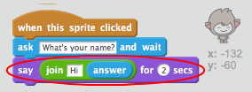

## Чат-бот, що розмовляє

Тепер, коли у вас є чат-бот з особистістю, давайте запрограмуємо його розмовляти з вами.

\--- task \---

Додайте до вашого чат-боту код, щоб після натискання, він запитував ваше ім'я, а потім казав: "Яке прекрасне ім'я!"

\--- hints \--- \--- hints \--- Коли кнопка ** натиснута**, він повинен** запитати **ваше ім'я. Тоді чат-бот повинен **сказати** "Яке чудове ім'я!" \--- /hint \--- \--- hint \--- Ось кодові блоки, які вам знадобляться:  \--- /hint \--- \--- hint \--- Ось як ваш код має виглядати:  \--- /hint \--- \--- /hints \---

\--- /task \---

\--- task \---

Тепер чат-бот просто відповідає: "Яке прекрасне ім'я!" кожного разу. Чи можете ви персоналізувати відповідь вашого чат-боту використовуючи вашу відповідь?

\--- hints \--- \--- hints \--- Коли кнопка ** натиснута**, він повинен** запитати **ваше ім'я. Тоді чат-бот має **сказати** "Привіт", а потім ваша **відповідь**. \--- /hint \--- \--- hint \--- Ось кодові блоки, які вам знадобляться:  \--- /hint \--- \--- hint \--- Так має виглядати ваш код:  \--- /hint \--- \--- /hints \---

\--- /task \---

\--- task \---

Якщо ви зберігаєте свою відповідь у **змінній**, то вона може бути використана пізніше. Створіть нову змінну `під назвою` зберегти своє ім'я.

[[[generic-scratch-add-variable]]]

\--- /task \---

\--- task \---

Чи можете ви зберегти свою відповідь `під назвою` змінна та використати її у відповіді вашого чат-боту?

Ваш код повинен працювати як і раніше: ваш чат-бот повинен сказати привіт, використовуючи ваше ім'я.

\--- hints \--- \--- hints \--- Коли кнопка ** натиснута**, він повинен** запитати **ваше ім'я. Потім вам слід **встановити** `ім'я` змінним до вашої **відповіді**. Тоді чат-бот має **сказати** "Привіт", а потім ваше **ім'я**. \--- /hint \--- \--- hint \--- Ось кодові блоки, які вам знадобляться:  \--- /hint \--- \--- hint \--- Так має виглядати ваш код:  \--- /hint \--- \--- /hints \---

\--- /task \---

\--- challenge \---

## Challenge: більше питань

Запрограмуйте вашого чат-бота ставити інші питання. Чи можете ви зберігати відповідь у новій змінній?

 \--- /challenge \---