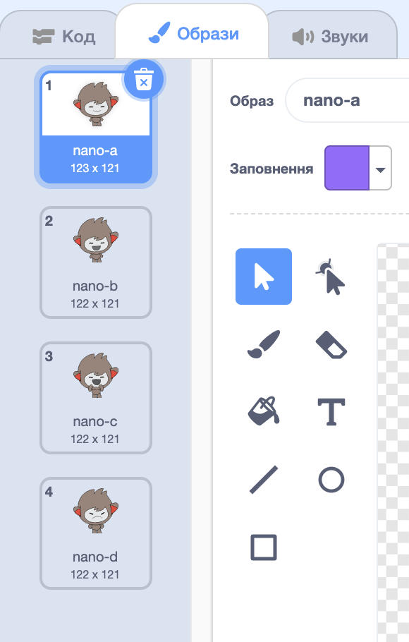

## Крок 3: Прийняття рішень

Ви можете запрограмувати вашого чат-бота вирішувати, що казати або відштовхуватись від ваших відповідей на питання.

\--- task \---

Чи можете ви запрограмувати чат-бота запитувати "Ти в порядку?", і запрограмувати відповідати "Радий це чути!" тільки **якщо** відповідь користувача "так"?

Щоб правильно перевірити свій новий код, потрібно перевірити його **двічі**, один раз з відповіддю "так", і один раз з відповіддю "ні".

Ваш чат-бот повинен відповісти "Радий це чути!" якщо ви відповідаєте "так", але не казати нічого, якщо ви відповідаєте "ні".

\--- hints \--- \--- hint \--- Після того, як ваш чат-бот сказав "Привіт", йому слід також **запитати** "Ти в порядку?". **Якщо** ви відповідаєте "так", тоді чат-бот повинен **сказати** "Радий це чути!". \--- /hint \--- \--- hint \--- Ось додаткові кодові блоки, які вам знадобляться:  \--- /hint \--- \--- hint \--- Так має виглядати ваш код:  \--- /hint \--- \--- /hints \---

\--- /task \---

\--- task \---

На даний момент ваш чат-бот не робить нічого, якщо ви відповідаєте "ні". Чи можна змінити вашого чат-бота, щоб він також відповідав "О ні!" якщо ви відповідаєте "ні" на запитання?

Перевірте та збережіть. Тепер ваш чат-бот повинен сказати "О ні!" якщо ви відповідаєте "ні". Насправді він буде сказати "О ні!" на будь-яку відповідь, окрім "так" ( **інше** в `якщо/інше` блок означає **в іншому випадку**).

\--- hints \--- \--- hint \--- Your chatbot should now say "That's great to hear!" **if** your answer is "yes", but should say "Oh no!" if you answer something **else**. \--- /hint \--- \--- hint \--- Here are the code blocks you'll need to use:  \--- /hint \--- \--- hint \--- Here's how your code should look:  \--- /hint \--- \--- /hints \---

\--- /task \---

\--- task \---

You can put any code inside an `if/else` block, not just code to make your chatbot speak. If you click your chatbot's **Costume** tab, you'll see that it has more than one costume.

\--- /task \---

\--- task \---

Can you change the chatbot's costume to match your response?

Test and save. You should see your chatbot's face change depending on your answer.

\--- hints \--- \--- hint \--- Your chatbot should now also **switch costume** depending on the answer given. \--- /hint \--- \--- hint \--- Here are the code blocks you'll need to use:  \--- /hint \--- \--- hint \--- Here's how your code should look:  \--- /hint \--- \--- /hints \---

\--- /task \---

\--- task \---

Have you noticed that your chatbot's costume stays the same that it changed to the last time you spoke to it? Can you fix this problem?

Test and save: Run your code and type "no", so that your chatbot looks unhappy. When you run your code again, your chatbot should change back to a smiling face before asking your name.

\--- hints \--- \--- hint \--- When the **sprite is clicked**, your chatbot should first **switch costume** to a smiling face. \--- /hint \--- \--- hint \--- Here's the code block you'll need to add:  \--- /hint \--- \--- hint \--- Here's how your code should look:  \--- /hint \--- \--- /hints \---

\--- /task \---

\--- challenge \---

## Challenge: more decisions

Program your chatbot to ask another question - something with a "yes" or "no" answer. Can you make your chatbot respond to the answer?

 \--- /challenge \---