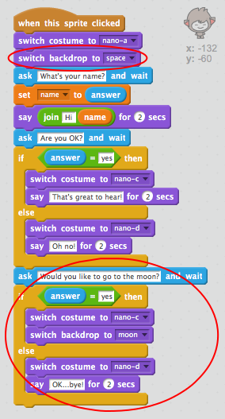
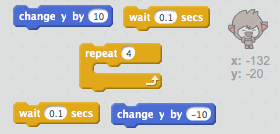

## Зміна розташування

Ви також можете кодувати ваш чат-бот, щоб змінити його розташування.

\--- task \---

Додайте інший фон до вашої платформи, наприклад, фон "місяць".

\--- /task \---

\--- task \---

Чи можете ви закодувати чат-бот запитати "Не хотіли б ви полетіти на Місяць?" а потім змінити розташування, якщо відповідь "так"?

Перевірте та збережіть. Якщо ви відповідаєте "так", ваш чат-бот повинен змінити місце розташування. Ваш чат-бот повинен виглядати сумним і говорити "окей... до побачення!" якщо надається будь-яка інша відповідь.

\--- hints \--- \--- hint \--- Ваш чат-бот має **запитати** "Чи не хотіли б ви полетіти на місяць?". **Якщо** ваша **відповідь** "так", тоді ваш чат-бот має **змінити вигляд** і виглядати щасливим і **фон** на платформі має змінитись.

Якщо ви відповідаєте "ні",чат-бот має **змінити вигляд** на сумний і **сказати** "Окей... до побачення!"

You'll also need to add code to start your chatbot in the right place **when clicked**. \--- /hint \--- \--- hint \--- Here are the code blocks you'll need to use:  \--- /hint \--- \--- hint \--- Here's how your code should look:  \--- /hint \--- \--- /hints \---

\--- /task \---

\--- task \---

Can you add code to make your chatbot jump for joy if you tell it you want to go to the moon?

Test and save. If you answer "yes", your chatbot should jump up and down. Your chatbot shouldn't jump if any other answer is given.

\--- hints \--- \--- hint \--- Your chatbot should jump by **changing** its **y position** by a small amount, and then changing its position back after a short **wait**. You may want to **repeat** this a few times. \--- /hint \--- \--- hint \--- Here are the code blocks you'll need to use:  \--- /hint \--- \--- hint \--- Here's how your code should look:  \--- /hint \--- \--- /hints \---

\--- /task \---