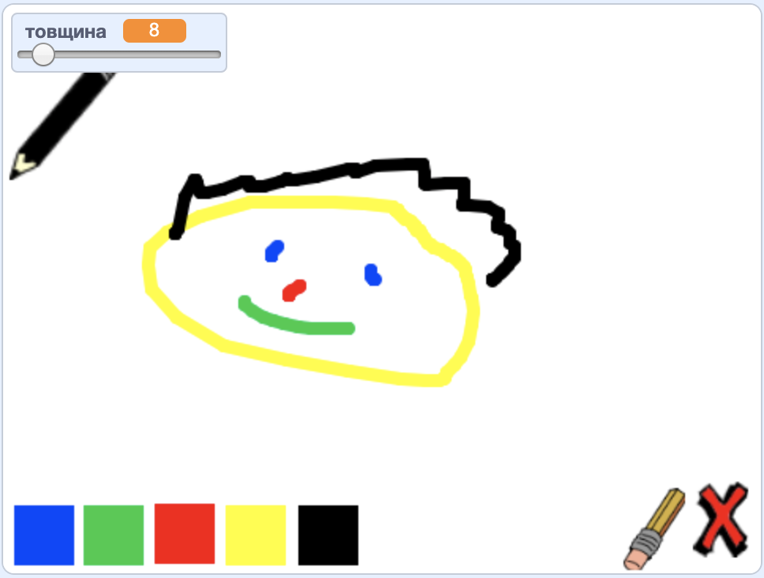

## Що далі?

Спробуй проєкт [Набір для малювання](https://projects.raspberrypi.org/en/projects/paint-box?utm_source=pathway&utm_medium=whatnext&utm_campaign=projects), де ти створиш власну програму для малювання!

--- no-print ---

Натисни на зелений прапор для запуску. Використовуй мишку, щоб переміщувати олівець, і затискай ліву клавішу мишки, щоб малювати. Клацай на кольори, щоб міняти олівці. Клацни на гумку, щоб вибрати її, і використовуй її для стирання своєї роботи. Для очищення сторінки натисни на хрест.

  <iframe allowtransparency="true" width="485" height="402" src="//scratch.mit.edu/projects/embed/267243161/?autostart=false" frameborder="0" scrolling="no"></iframe>
  

--- /no-print ---

--- print-only ---

Ти клацнеш на зелений прапор для запуску, а потім використовуватимеш мишку, щоб переміщувати олівець, і затискатимеш ліву клавішу мишки для малювання. Натискання на кольори змінюватиме кольори олівців, а клацання на гумку вибиратиме натомість її!

--- /print-only ---
