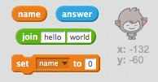

## ایک بات چیت بات چیت

اب کہ آپ کو ایک شخصیت کے ساتھ ایک چیٹ بٹ ہے، چلو پروگرام آپ سے بات کرتی ہے.

\--- کام \---

اپنے چیٹ بٹ میں کوڈ شامل کریں تاکہ جب اس پر کلک کریں تو، یہ آپ کے نام سے پوچھتا ہے اور پھر کہتے ہیں "کیا ایک خوبصورت نام!"

\--- اشارہ \--- \--- اشارہ \--- chatbot جب **سپرائٹ کلک کیا جاتا ہے**، یہ ہونا چاہئے **پوچھنا** آپ کا نام لئے. چیٹ بٹ تو پھر **کا کہنا ہے کہ** "کیا خوبصورت نام!" \--- / اشارہ \--- \--- اشارہ \--- یہاں کوڈ بلاکس آپ کی ضرورت ہو گی:  \--- / اشارہ \--- \--- اشارہ \--- یہاں آپ کا کوڈ کس طرح نظر آنا چاہئے:  - - / اشارہ \--- \--- / اشارہ \---

\--- / کام \---

\--- کام \---

اب چیٹ بس صرف "جواب کا نام" ہے. ہر وقت. کیا آپ اپنے جواب کے استعمال سے اپنے چیٹ بٹ کے جواب کو ذاتی بنا سکتے ہیں؟

\--- اشارہ \--- \--- اشارہ \--- chatbot جب **سپرائٹ کلک کیا جاتا ہے**، یہ ہونا چاہئے **پوچھنا** آپ کا نام لئے. اس کے بعد چیٹ بٹ **کا کہنا ہے کہ** "ہیلو"، آپ کے **جواب**. \--- / اشارہ \--- \--- اشارہ \--- یہاں کوڈ بلاکس آپ کو ضرورت ہو گی:  \--- / اشارہ \--- \--- اشارہ \--- یہاں آپ کا کوڈ کیسے نظر آتا ہے:  - - / اشارہ \--- \--- / اشارہ \---

\--- / کام \---

\--- کام \---

اگر آپ اپنے جواب کو **متغیر**میں ذخیرہ کرتے ہیں تو، اس کے بعد بعد میں استعمال کیا جا سکتا ہے. اپنے نام کو ذخیرہ کرنے کیلئے `نام` نامی ایک نئی متغیر بنائیں.

[[[generic-scratch-add-variable]]]

\--- / کام \---

\--- کام \---

آپ میں آپ کے جواب محفوظ کر سکتے ہیں `نام` متغیر اور آپ chatbot کے جواب میں اس کا استعمال؟

آپ کا کوڈ پہلے ہی کام کرنا چاہئے: آپ کے نام کا استعمال کرتے ہوئے آپ کے چیٹ بٹ کو ہیلو چاہئے.

\--- اشارہ \--- \--- اشارہ \--- chatbot جب **سپرائٹ کلک کیا جاتا ہے**، یہ ہونا چاہئے **پوچھنا** آپ کا نام لئے. اس کے بعد آپ چاہئے **مقرر** `نام` آپ کو متغیر **جواب**. اس کے بعد چیٹ بٹ **کا کہنا ہے کہ** "ہیلو"، آپ کے نام **بعد**. \--- / اشارہ \--- \--- اشارہ \--- یہاں کوڈ بلاکس آپ کو ضرورت ہو گی:  \--- / اشارہ \--- \--- اشارہ \--- یہاں آپ کا کوڈ کیسے نظر آتا ہے:  - - / اشارہ \--- \--- / اشارہ \---

\--- / کام \---

\--- چیلنج \--- \---

## چیلنج: مزید سوالات

ایک اور سوال پوچھنا آپ کے چیٹ بٹ پروگرام. کیا آپ جواب کو نئے متغیر میں ذخیرہ کرسکتے ہیں؟

 \--- / چیلنج \---