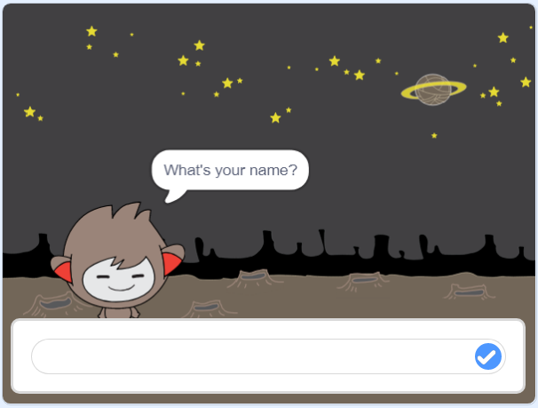

## Đưa ra quyết định

Bạn có thể lập trình chatbot của mình để quyết định phải làm gì dựa trên câu trả lời mà nó nhận được.

Trước tiên, bạn sẽ làm cho chatbot của mình hỏi một câu hỏi có thể được trả lời bằng "có" hoặc "không".

\--- task \---

Thay đổi mã chatbot của bạn. Chatbot của bạn nên đặt câu hỏi "Bạn có ổn không", sử dụng biến `name`{: class = "block3variables"}. Sau đó, nó sẽ trả lời "Thật tuyệt khi nghe!" `nếu`{: class = "block3control"} câu trả lời mà nó nhận được là "có", nhưng không nói gì nếu câu trả lời là "không".


```blocks3
khi sprite này nhấp
hỏi [Tên bạn là gì?] và đợi
bộ [name v] thành (trả lời)
nói (tham gia [Hi] (tên)) trong (2) giây
+ hỏi (tham gia [Bạn có ổn không] (tên)) và đợi
+ nếu <(trả lời) = [yes]> thì 
  nói [Thật tuyệt khi nghe!] trong (2) giây
kết thúc
```

Để kiểm tra mã mới của bạn đúng cách, bạn nên kiểm tra mã **hai lần**: một lần với câu trả lời "có" và một lần với câu trả lời "không".

\--- /bài tập \---

Hiện tại, chatbot của bạn không nói gì với câu trả lời "không".

\--- task \---

Thay đổi mã chatbot của bạn để nó trả lời "Ồ không!" nếu nó nhận được "không" là câu trả lời cho "Bạn có ổn không".

Thay thế khối `if, sau đó`{: class = "block3control"} bằng khối `if, sau đó, khác`{: class = "block3control"} và bao gồm mã để chatbot có thể `nói "Ồ không!"`{: class = "block3looks"}.


```blocks3
khi sprite này nhấp
hỏi [Tên của bạn là gì?] và đợi
bộ [name v] thành (trả lời)
nói (tham gia [Hi] (tên)) trong (2) giây
hỏi (tham gia [Bạn có ổn không] tên)) và đợi

+ nếu <(câu trả lời) = [yes]> thì 
  nói [Thật tuyệt khi nghe!] trong (2) giây
khác 
+ nói [Ồ không!] trong (2) giây
kết thúc
```

\--- /bài tập \---

\--- task \---

Kiểm tra mã của bạn. Bạn sẽ nhận được phản hồi khác nhau khi bạn trả lời "không" và khi bạn trả lời "có": chatbot của bạn sẽ trả lời bằng "Thật tuyệt khi nghe!" khi bạn trả lời "có" (không phân biệt chữ hoa chữ thường) và trả lời "Ồ không!" khi bạn trả lời **bất cứ điều gì khác**.


\--- /task \---

Bạn có thể đặt bất kỳ mã nào bên trong khối `nếu, sau đó, khác`{: class = "block3control"}, không chỉ mã để làm cho chatbot của bạn nói!

Nếu bạn nhấp vào tab **Trang phục** của chatbot, bạn sẽ thấy có nhiều hơn một trang phục.


\--- task \---

Thay đổi mã chatbot của bạn để chatbot chuyển trang phục khi bạn nhập câu trả lời.


Thay đổi mã bên trong khối `nếu, sau đó, khác`{: class = "block3control"} thành `trang phục chuyển đổi`{: class = "block3looks"}.


```blocks3
khi sprite này nhấp
hỏi [Tên của bạn là gì?] và đợi
bộ [name v] thành (trả lời)
nói (tham gia [Hi] (tên)) trong (2) giây
hỏi (tham gia [Bạn có ổn không] tên)) và đợi
nếu <(câu trả lời) = [yes]> rồi 

+ chuyển trang phục sang (nano-c v)
  nói [Thật tuyệt khi nghe!] trong (2) giây
khác 
+ chuyển trang phục sang (nano- d v)
  nói [Ồ không!] trong (2) giây
kết thúc
```

Kiểm tra và lưu mã của bạn. Bạn sẽ thấy khuôn mặt của chatbot thay đổi tùy theo câu trả lời của bạn.

\--- /task \---

Bạn có nhận thấy rằng, sau khi trang phục chatbot của bạn thay đổi, nó vẫn như vậy và không thay đổi trở lại như lúc ban đầu?

Bạn có thể thử điều này: chạy mã của bạn và trả lời "không" để khuôn mặt chatbot của bạn thay đổi thành một cái nhìn không vui. Sau đó chạy lại mã của bạn và nhận thấy rằng chatbot của bạn không thay đổi trở lại trông hạnh phúc trước khi nó hỏi tên của bạn.


\--- task \---

Để khắc phục sự cố này, hãy thêm mã của chatbot vào `trang phục chuyển đổi`{: class = "block3looks"} ở đầu `khi nhấp vào sprite`{: class = "block3events"}.


```blocks3
khi sprite này nhấp

+ chuyển trang phục sang (nano-a v)
hãy hỏi [Tên bạn là gì?] và chờ đợi
```



\--- /task \---