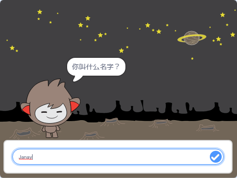

## 简介

You are going to learn how to program a character that can talk to you! A character like that is called a chat robot, or chatbot.

### 学习成果

\--- no-print \---

Click on the green flag, and then click on the chatbot character to start a conversation. When the chatbot asks a question, type your answer into the box at the bottom of the Stage, and then click on the blue mark on the right (or press `Enter`) to see the chatbot's reply.

  <iframe allowtransparency="true" width="485" height="402" src="https://scratch.mit.edu/projects/embed/248864190/?autostart=false" 
  frameborder="0" scrolling="no"></iframe>

\--- /no-print \---

\--- print-only \---

\--- /print-only \---

## \--- collapse \---

## title: 你需要准备什么

### 硬件

- 能够运行Scratch 3的电脑

### 软件

- Scratch 3（[在线版](https://rpf.io/scratchon)或[离线版](https://rpf.io/scratchoff)）

### 下载

- [Find files to download here](https://rpf.io/p/en/chatbot-go).

\--- /collapse \---

## \--- collapse \---

## title: 你将学到什么

- Use code to join text in Scratch
- 了解变量可用于存储用户输入
- 使用条件选择响应用户在 Scratch 中的输入

\--- /collapse \---

## \--- collapse \---

## title: 教师附加说明

\--- no-print \---

If you need to print this project, please use the [printer-friendly version](https://projects.raspberrypi.org/en/projects/chatbot/print){:target="_blank"}.

\--- /no-print \---

You can find the [completed project here](https://rpf.io/p/en/chatbot-get).

\--- /collapse \---