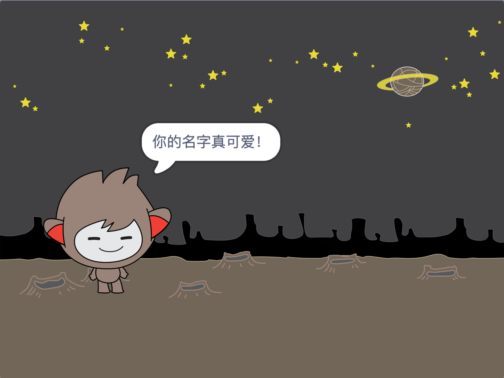

## 会说话的机器人

既然你有一个有个性的聊天机器人，你就要编程让它跟你说话。

\--- task \---

点击你的聊天机器人精灵，加入以下代码，以便 `它被点击时`{:class=“block3events”}，`它问你的姓名`{:class=“block3sensing”}，然后 `说：“你的名字真可爱！“`{:class =“block3looks”}。


```blocks3
当角色被点击
询问 [你叫什么名字？] 并等待
说 [你的名字真可爱！] (2) 秒
```

\--- /task \---

\--- task \---

单击您的聊天机器人以测试您的代码。当聊天机器人询问您的姓名时，请在舞台底部显示的框中键入，然后单击蓝色标记，或按 <kbd>输入</kbd>。




\--- /task \---

\--- task \---

现在，每次你回答时，您的聊天机器人回复“你的名字真可爱！”。您可以使聊天机器人的回复更加个性化，以便每次输入其他名称时回复都不同。

将聊天机器人精灵的代码更改为 `加入`{:class =“block3operators”}“嗨”， `回答`{:class =“block3sensing”}改为“你叫什么名字？”问题，所以代码看起来像这样：


```blocks3
当角色被点击
询问 [你的名字是什么？] 并等待
说 (连接 [嗨 ] 和 (回答) :: +) (2) 秒
```


\--- /task \---

\--- task \---

通过将答案存储在 **变量**，您可以在项目的任何位置使用它。

创建一个名为 `name`{:class =“block3variables”}的新变量。

[[[generic-scratch3-add-variable]]]

\--- /task \---

\--- task \---

现在，改变你的聊天机器人精灵的代码所设置的 `名`{:class=“block3variables”}变量 `回答`{:class=“block3sensing”}：


```blocks3
当角色被点击
询问 [你的名字是什么？] 并等待
+将 [name v] 设为 (回答)
说 (连接 [嗨] 和 (name :: + variables)) (2) 秒
```

您的代码应该像以前一样工作：您的聊天机器人应该使用您输入的名称打招呼。


\--- /task \---

再次测试你的程序。 请注意，您键入的答案存储在 `名称`{：class =“block3variables”}变量中，并且还显示在舞台的左上角。 To make it disappear from the Stage, go to the `Variables`{:class="block3variables"} blocks section and click on the box next to `name`{:class="block3variables"} so that it is not marked.