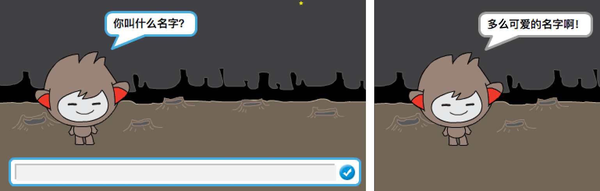
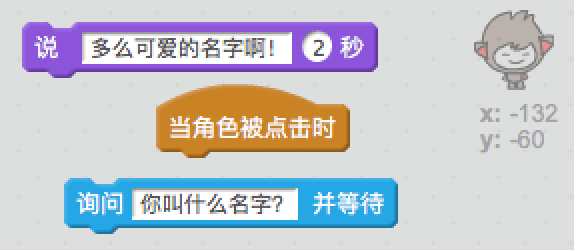
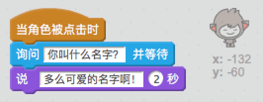
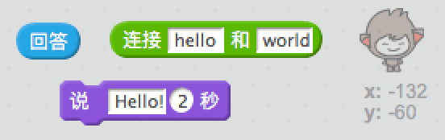
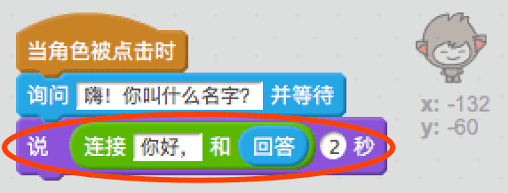
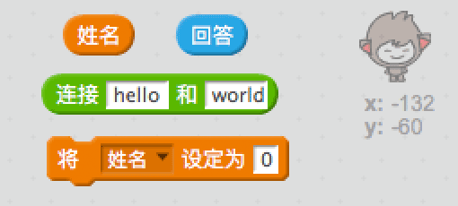
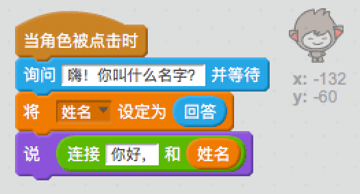
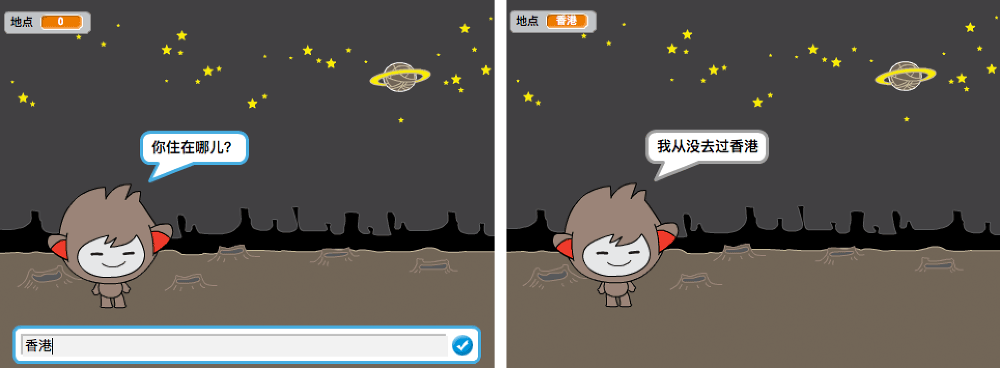

## 一台会说话的聊天机器人

现在你已经拥有了一台具有个性的聊天机器人，让我们来对其进行编程，使其能和你交流。

+ 向你的聊天机器人添加代码，使其在被点击时，能询问你的名字，然后说“多么可爱的名字呀！”

    

[[[generic-scratch-saving]]]

--- hints ---
--- hint ---
当聊天机器人__子图被点击__时，它应该__询问__你的名字。聊天机器人随后应该__说__“多么可爱的名字呀！”
--- /hint ---
--- hint ---
以下是你将需要的代码块：

--- /hint ---
--- hint ---
你的代码应如下所示：

--- /hint ---
--- /hints ---

+ 现在聊天机器人每次只能简单回复“多么可爱的名字呀！”。你能否利用你的回答对你聊天机器人的回答进行个性化设置？

    

--- hints ---
--- hint ---
当聊天机器人__子图被点击__时，它应该__询问__你的名字。聊天机器人随后应该__说__“嗨”，然后是你的__回答__。
--- /hint ---
--- hint ---
以下是你将需要的代码块：

--- /hint ---
--- hint ---
你的代码应如下所示：

--- /hint ---
--- /hints ---

+ 如果你将你的回答储存在**变量**中，那么之后还可以使用。创建一个被称作`name`（名字）的新变量来储存你的名字。

[[[generic-scratch-add-variable]]]

+ 你能否将你的回答储存在`name`（名字）变量中，并将其用于聊天机器人的回复？

    你的代码应和之前一样运行：你的聊天机器人应使用你的名字说你好。

    

--- hints ---
--- hint ---
当聊天机器人__子图被点击__时，它应该__询问__你的名字。然后你应该将`name`（名字）变量__设定__为你的__回答__。聊天机器人随后应该__说__“嗨”，然后是你的__名字__。
--- /hint ---
--- hint ---
以下是你将需要的代码块：

--- /hint ---
--- hint ---
你的代码应如下所示：

--- /hint ---
--- /hints ---

--- challenge ---
## 挑战：更多问题

对你的聊天机器人进行编程来提出另一个问题。你能否将回答储存在一个新变量中？

--- /challenge ---
