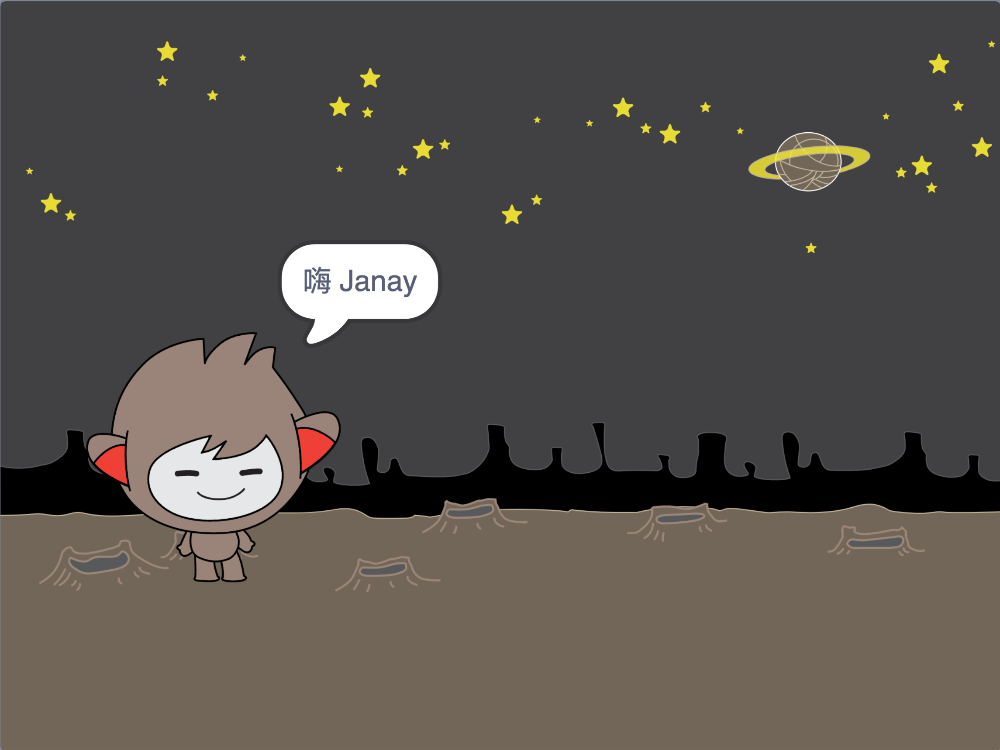

## 会说话的机器人

现在你有了一个具有个性的机器人，接下来让我们编程让它可以跟你交谈，

\--- task \---

点击机器人为你的聊天机器人添加代码，它询问你的名字然后回复“多么可爱的名字啊！”

\--- hints \--- \--- hint \--- 当聊天机器人**角色被点击**时，它会**询问**你的名字。 聊天机器人接着会**说**“多么可爱的名字啊！” \--- /hint \--- \--- hint \--- 这是你需要用到的代码块：  \--- /hint \--- \--- hint \--- 你的代码应该如下图这样：  \--- /hint \--- \--- /hints \---

\--- /task \---

\--- task \---

现在聊天机器人每次都会简单的回应“多么可爱的名字啊！”。你能让你的聊天机器人回应时引用你的回答吗？

\--- hints \--- \--- hint \--- 当聊天机器人**角色被点击**时，它会**询问**你的名字。 然后聊天机器人会**说**“你好”，后面跟着你的**回答**。 \--- /hint \--- \--- hint \--- 这是你需要用到的代码块：  \--- /hint \--- \--- hint \--- 你的代码应该如下图这样：  \--- /hint \--- \--- /hints \---

\--- /task \---

\--- task \---

如果你将你的回答保存到**变量**中，那么就可以等后面需要的时候再使用。创建一个名叫`姓名`的新变量来保存你的姓名。

[[[generic-scratch-add-variable]]]

\--- /task \---

\--- task \---

你能将你的回答保存到`姓名`变量并在聊天机器人回复时使用吗？

你的代码的运行结果应该跟之前一样：聊天机器人会说你好后面是你的名字。

\--- hints \--- \--- hint \--- 当聊天机器人**角色被点击**时，它会**询问**你的名字。 然后你应该将`名字`变量**设置**为你的**回答**。 接着聊天机器人会**说**“你好”，后面跟你的**名字**。 \--- /hint \--- \--- hint \--- Here are the code blocks you'll need:  \--- /hint \--- \--- hint \--- Here's how your code should look:  \--- /hint \--- \--- /hints \---

\--- /task \---

\--- challenge \---

## Challenge: more questions

Program your chatbot to ask another question. Can you store the answer in a new variable?

 \--- /challenge \---