## 第 3 步：判定

你可以对你的聊天机器人进行编程，从而基于你对其问题的回复，来判定说什么或做什么。

+ 你能否使聊天机器人提出“你好吗？”的问题，并对其进行编码，使其只有__在__用户回答“是”的时候回复“很高兴听到这句话！”？

    为适当地测试你的新代码，你需要测试__两次__，一次使用答案“是”，另一次使用答案“不”。

    如果你回答“是”，你的聊天机器人应回复“很高兴听到这句话！”，但如果你回答“不”，便无回复。

    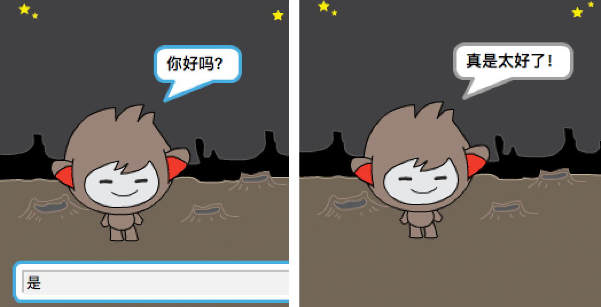

--- hints ---
--- hint ---
你的聊天机器人说完“嗨”之后，现在还应该__询问__“你好吗？”。__如果__你回答“是”，那么聊天机器人应该__说__“很高兴听到这句话！”。
--- /hint ---
--- hint ---
以下是你将另外需要的代码块：
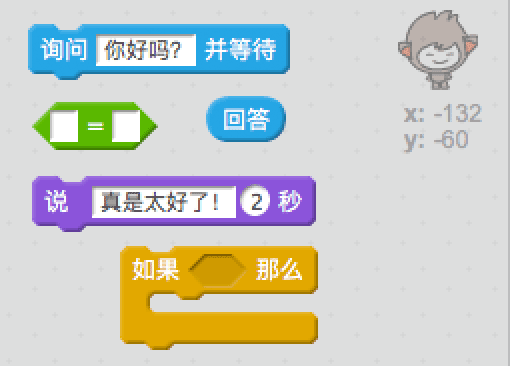
--- /hint ---
--- hint ---
你的代码应如下所示：
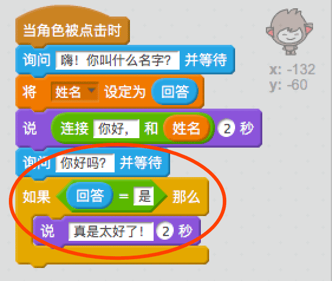
--- /hint ---
--- /hints ---

+ 此时，如果你回答“不”，你的聊天机器人将什么都不会说。你能否更改你的聊天机器人，使其在你对其问题回答“不”时也回复“噢不！”。

    测试并保存。现在，你的聊天机器人应在你回答“不”时说“噢不！”。事实上，如果你回答除“是”之外的任何内容，它都会说“噢不！”（`if/else`代码块中的__else__意为__否则__）。

    

--- hints ---
--- hint ---
现在，__如果__你回答“是”，你的聊天机器人应说“很高兴听到这句话！”，但如果你回答__其他__内容，就会说“噢不！”。
--- /hint ---
--- hint ---
以下是你将需要使用的代码块：
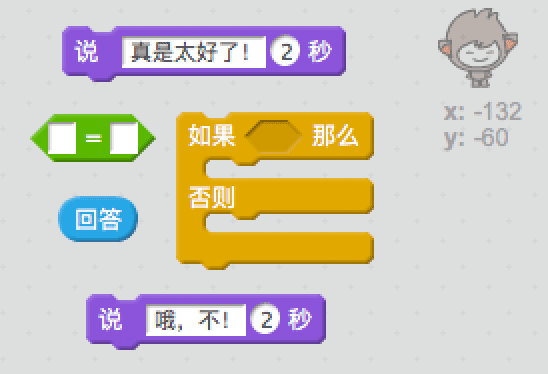
--- /hint ---
--- hint ---
你的代码应如下所示：
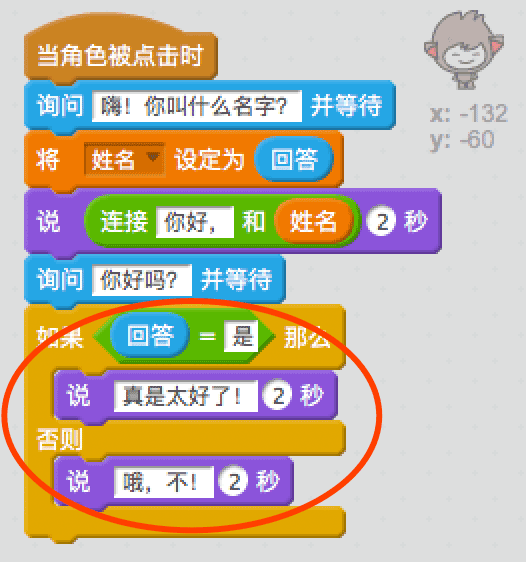
--- /hint ---
--- /hints ---

+ 你可以将任何代码放进`if/else`代码块中，并非只有使你的聊天机器人说话的代码。如果你点击聊天机器人的**Costume**（造型）选项卡，你会看到其不止有一种造型。

    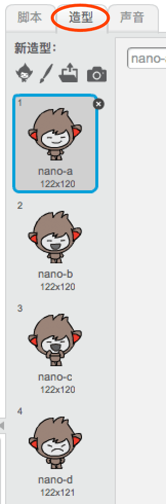

+ 你能否更改聊天机器人的造型以匹配你的回复？

    测试并保存。你会看到聊天机器人的面部表情会根据你的回答改变。

    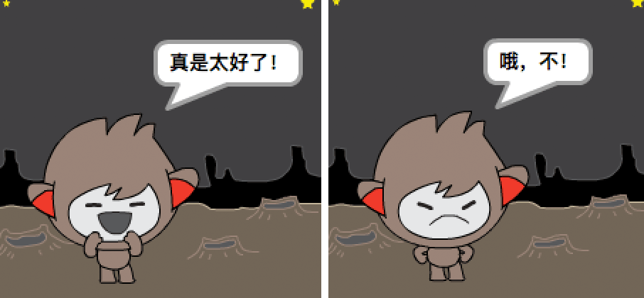

--- hints ---
--- hint ---
现在，你的聊天机器人还应根据收到的答案__切换造型__。
--- /hint ---
--- hint ---
以下是你将需要使用的代码块：
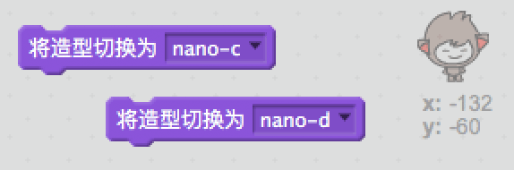
--- /hint ---
--- hint ---
你的代码应如下所示：
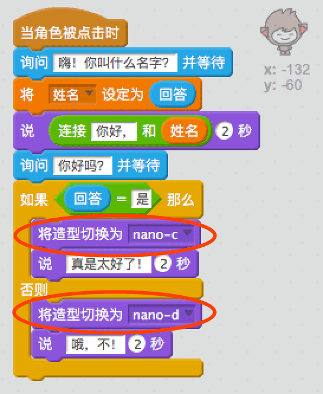
--- /hint ---
--- /hints ---

+ 你是否注意到了你的聊天机器人造型与你上次跟它说话时所变更的造型相同？你能否解决这个问题？

    

    测试并保存：运行你的代码并输入“不”，使你的聊天机器人看起来不开心。当你再次运行代码时，你的聊天机器人应在询问你的名字之前变回笑脸。

    

--- hints ---
--- hint ---
__点击子图__时，你的聊天机器人应首先__切换造型__，变为笑脸。
--- /hint ---
--- hint ---
以下是你将需要添加的代码块：
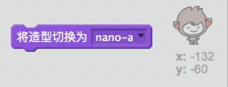
--- /hint ---
--- hint ---
你的代码应如下所示：
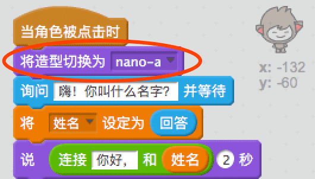
--- /hint ---
--- /hints ---

--- challenge ---
## 挑战：更多判定

对你的聊天机器人进行编程来提出另一个问题 - 用“是”或“不”回答的问题。你能否使你的聊天机器人对回答做出反应？

--- /challenge ---
