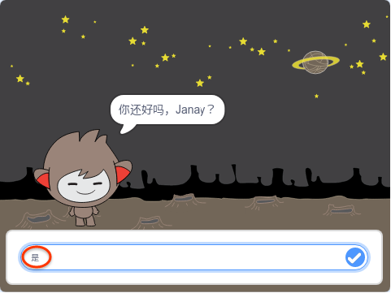
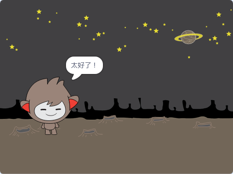
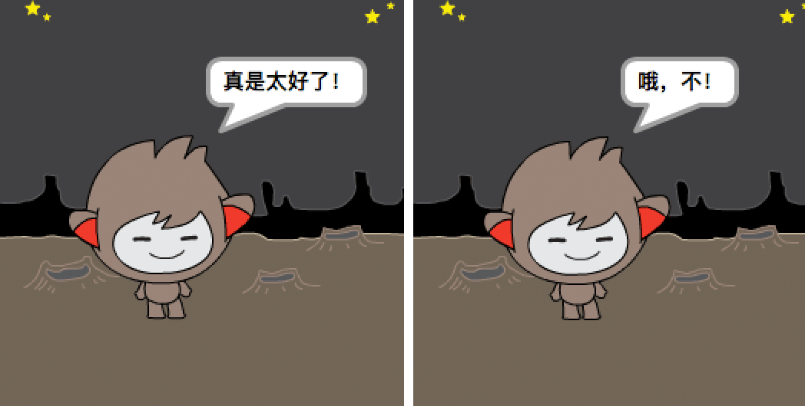
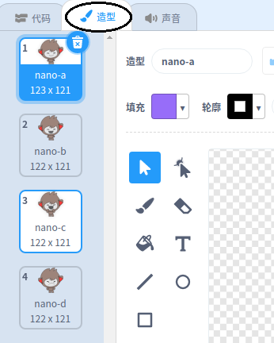
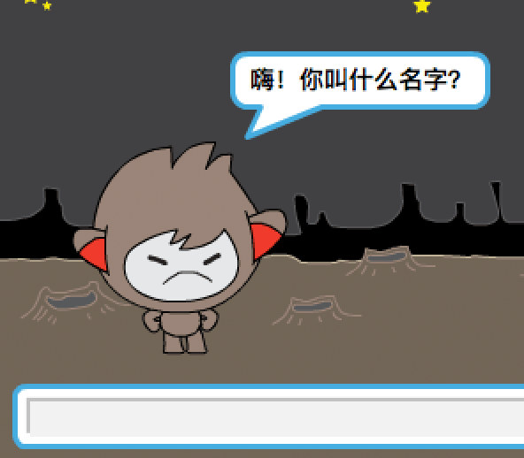
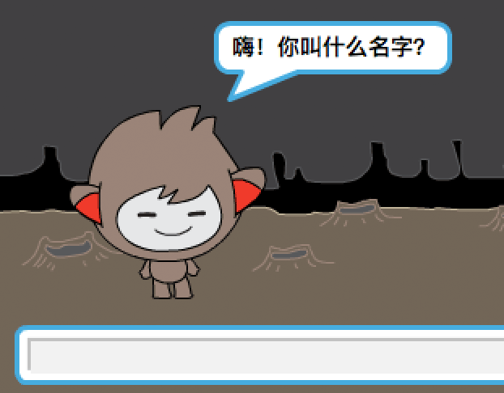

## 决策

您可以对聊天机器人进行编程，以根据收到的答案决定做什么。

首先，你要让你的聊天机器人提出一个可以用“是”或“否”回答的问题。

--- task ---

更改聊天机器人的代码。 您的聊天机器人应该使用 `名称`{:class="block3variables"}变量来询问“你的名字是否正确”。 然后它应该回答“这听起来很棒！” `如果`{:class="block3control"}它收到的答案是“是”，但如果答案为“否”则不说。






```blocks3
当角色被点击
询问 [你的名字是什么？] 并等待
将 [名称 v] 设为 (回答)
说 (连接 [你好 ] 和 (名称)) (2) 秒
+ 询问 (连接 [你还好 ] 和 (名称)) 并等待
+ 如果 <(回答) = [是]> 那么 
    说 [很高兴听到！] (2) 秒
end
```

要正确测试新代码，你应该测试它 **两次**：一次回答“是”，一次回答“否”。

--- /task ---

目前，您的聊天机器人并没有对答案“不”说任何话。

--- task ---

更改聊天机器人的代码，以便回复“哦不！”如果它收到“否”作为“你好名字”的答案。

将 `如果，那么`{:class="block3control"}块替换为 `如果，那么，否则`{:class="block3control"}块，并包含代码，以便聊天机器人可以 `说“哦不！”`{:class="block3looks"}。


```blocks3
当角色被点击
询问 [你的名字是什么？] 并等待
将 [名称 v] 设为 (回答)
说 (连接 [你好 ] 和 (名称)) (2) 秒
询问 (连接 [你还好 ] 和 (名称)) 并等待
+ 如果 <(回答) = [是]> 那么 
    说 [很高兴听到！] (2) 秒
否则 
+  说 [哦不！] (2) 秒
end
```

--- /task ---

--- task ---

测试你的代码。 当你回答“否”并回答“是”时，你应该得到一个不同的回答：你的聊天机器人应该回答“这听起来很棒！”当你回答“是”（不区分大小写）时，回复“哦不！”当你回答 **其他任何事情**。




--- /task ---

您可以将任何代码放在 `如果，然后，`{:class="block3control"}块中，而不仅仅是使聊天机器人说话的代码！

如果您单击聊天机器人的 **服装** 选项卡，您将看到有多个服装。



--- task ---

更改聊天机器人的代码，以便在您输入答案时聊天机器人切换服装。


将 `的代码更改为if，然后将`{:class="block3control"}块更改为 `换成`{:class="block3looks"}。


```blocks3
当角色被点击
询问 [你的名字是什么？] 并等待
将 [名称 v] 设为 (回答)
说 (连接 [你好 ] 和 (名称)) (2) 秒
询问 (连接 [你还好 ] 和 (名称)) 并等待
如果 <(回答) = [是]> 那么 
+ 换成 (nano-c v) 造型
  说 [那真是太好了！] (2) 秒
否则 
+ 换成 (nano-d v) 造型
  说 [哦不！] (2) 秒
end
```

测试并保存您的代码。您应该看到聊天机器人的脸部会根据您的答案而改变。

--- /task ---

您是否注意到，在您的聊天机器人的服装发生变化之后，它会保持这种状态并且不会改变回原来的状态？

您可以尝试这样做：运行您的代码并回答“否”，以便您的聊天机器人的脸变得不快乐。 然后再次运行您的代码并注意您的聊天机器人在询问您的姓名之前不会变回看起来很开心。



--- task ---

要解决此问题，`请在点击精灵`{:class="block3events"}时，在开始 处将聊天机器人的代码添加到 `切换服装`{:class="block3looks"}。


```blocks3
当角色被点击
+ 换成 (nano-a v) 造型
询问 [你叫什么名字？] 并等待
```



--- /task ---