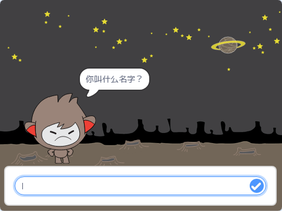

## 第3步：做出判断

你可以编程让你的聊天机器人根据你对它问题的回复决定说什么或做什么。

\--- task \---

你能让聊天机器人问“你好吗？”，然后编程让它**仅当**用户回答“好”的时候回复“真是太好了！”

为了正确测试你的新代码，你需要测试**两次**，一次回答“好”，另一次回答“不好”。

当你回答“好”时，聊天机器人回复“真是太好了！”，如果回答“不好”机器人将什么也不说。

\--- hints \--- \--- hint \--- 聊天机器人说完“你好”后，还会**问**“你好吗？” **如果**你回答“好”，那么聊天机器人会**说**“真是太好了！”。 \--- /hint \--- \--- hint \--- 这是你需要用到的代码块：  \--- /hint \--- \--- hint \--- 你的代码应该如下图这样：  \--- /hint \--- \--- /hints \---

\--- /task \---

\--- task \---

此时当你说“不好”时，你的聊天机器人什么也不说。你能改造一下你的聊天机器人当你说“不好”时它会回复“哦，不！”吗？

测试并保存。 你的聊天机器人在你说”不好“时会说”哦，不！“。 实际上，只要你回答的不是“好”，它都会说“哦，不！”（**否则**在`如果/否则`代码块中表示**所有其他的情况**）。

\--- hints \--- \--- hint \--- 现在**如果**你回答“好”，你的聊天机器人会说“这是太好了！”，但如果你回答**其他答案**，它会说“哦，不！”。 \--- /hint \--- \--- hint \--- 这是你需要用到的代码块：  \--- /hint \--- \--- hint \--- 你的代码应该如下图这样：  \--- /hint \--- \--- /hints \---

\--- /task \---

\--- task \---

You can put any code inside an `if/else` block, not just code to make your chatbot speak. If you click your chatbot's **Costume** tab, you'll see that it has more than one costume.

\--- /task \---

\--- task \---

Can you change the chatbot's costume to match your response?

Test and save. You should see your chatbot's face change depending on your answer.

\--- hints \--- \--- hint \--- Your chatbot should now also **switch costume** depending on the answer given. \--- /hint \--- \--- hint \--- Here are the code blocks you'll need to use:  \--- /hint \--- \--- hint \--- Here's how your code should look:  \--- /hint \--- \--- /hints \---

\--- /task \---

\--- task \---

Have you noticed that your chatbot's costume stays the same that it changed to the last time you spoke to it? Can you fix this problem?

Test and save: Run your code and type "no", so that your chatbot looks unhappy. When you run your code again, your chatbot should change back to a smiling face before asking your name.

\--- hints \--- \--- hint \--- When the **sprite is clicked**, your chatbot should first **switch costume** to a smiling face. \--- /hint \--- \--- hint \--- Here's the code block you'll need to add:  \--- /hint \--- \--- hint \--- Here's how your code should look:  \--- /hint \--- \--- /hints \---

\--- /task \---

\--- challenge \---

## Challenge: more decisions

Program your chatbot to ask another question - something with a "yes" or "no" answer. Can you make your chatbot respond to the answer?

 \--- /challenge \---