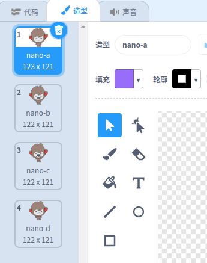

## 第3步：做出判断

你可以编程让你的聊天机器人根据你对它问题的回复决定说什么或做什么。

\--- task \---

你能让聊天机器人问“你好吗？”，然后编程让它**仅当**用户回答“好”的时候回复“真是太好了！”

为了正确测试你的新代码，你需要测试**两次**，一次回答“好”，另一次回答“不好”。

当你回答“好”时，聊天机器人回复“真是太好了！”，如果回答“不好”机器人将什么也不说。

\--- hints \--- \--- hint \--- 聊天机器人说完“你好”后，还会**问**“你好吗？” **如果**你回答“好”，那么聊天机器人会**说**“真是太好了！”。 \--- /hint \--- \--- hint \--- 这是你需要用到的代码块：  \--- /hint \--- \--- hint \--- 你的代码应该如下图这样：  \--- /hint \--- \--- /hints \---

\--- /task \---

\--- task \---

此时当你说“不好”时，你的聊天机器人什么也不说。你能改造一下你的聊天机器人当你说“不好”时它会回复“哦，不！”吗？

测试并保存。 你的聊天机器人在你说”不好“时会说”哦，不！“。 实际上，只要你回答的不是“好”，它都会说“哦，不！”（**否则**在`如果/否则`代码块中表示**所有其他的情况**）。

\--- hints \--- \--- hint \--- 现在**如果**你回答“好”，你的聊天机器人会说“这是太好了！”，但如果你回答**其他答案**，它会说“哦，不！”。 \--- /hint \--- \--- hint \--- 这是你需要用到的代码块：  \--- /hint \--- \--- hint \--- 你的代码应该如下图这样：  \--- /hint \--- \--- /hints \---

\--- /task \---

\--- task \---

你可以在`如果/否则`代码块中放任何代码，不单单是编码让聊天机器人说话。 如果你点击聊天机器人的**造型**选项卡，你会看到它有不只一个造型。

\--- /task \---

\--- task \---

你能更换机器人的造型让它跟你的回复匹配吗？

测试并保存。你应该看到你的聊天机器人的表情根据你的回答而改变。

\--- hints \--- \--- hint \--- 你的聊天机器人现在应该会根据给定答案**切换造型**。 \--- /hint \--- \--- hint \--- 这是你需要用到的代码块：  \--- /hint \--- \--- hint \--- 你的代码应该如下图这样：  \--- /hint \--- \--- /hints \---

\--- /task \---

\--- task \---

你有没有发现，聊天机器人的造型会一直保持在上一题的造型不变？你能修复这个问题吗？

测试并保存。运行你的代码并输入“不”，于是你的机器人会看起来不开心。当你再次运行代码，当问你名字前你的机器人应该变回微笑表情。

\--- hints \--- \--- hint \--- 当**角色被点击**时，聊天机器人应当首先**切换造型**到微笑表情。 \--- /hint \--- \--- hint \--- 这是你需要用到的代码块：  \--- /hint \--- \--- hint \--- 你的代码应该如下图这样：  \--- /hint \--- \--- /hints \---

\--- /task \---

\---challenge \---

## 挑战: 更多判断

编程让聊天机器人问另一个可以用“是”和“否”来回答的问题。你能让聊天机器人根据答案做出回应吗？

 \--- /challenge \---