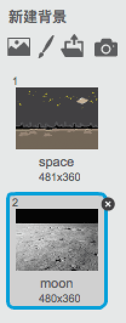
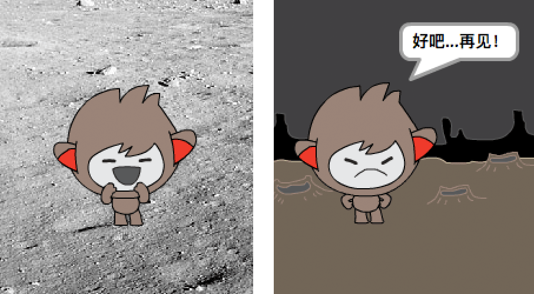
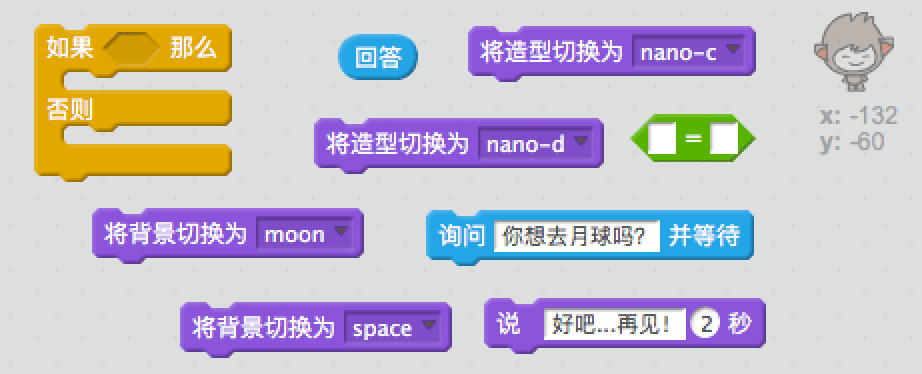
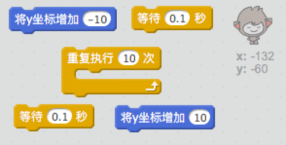
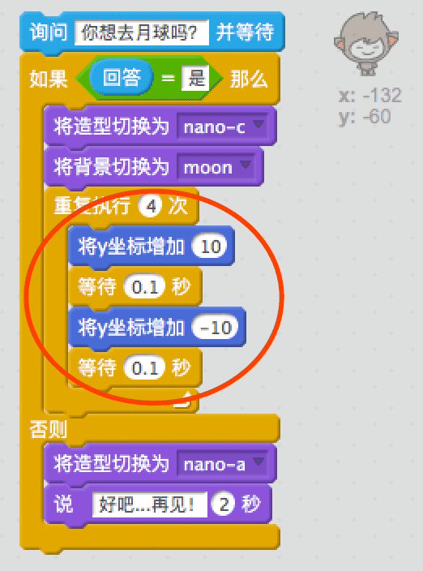

## 改变位置

你还可以对你的聊天机器人进行编码使其改变位置。

+ 向你的工作区添加另一个背景，比如“月球”背景。

	

+ 你能否对你的聊天机器人进行编码使其询问“你想去月球吗？”，然后如果你回答“是”，则更改位置？

    测试并保存。如果你回答“是”，你的聊天机器人就会改变位置。
如果你给出任何其他回答，你的聊天机器人会看上去很伤心并说“好吧...再见！”。

    

--- hints ---
--- hint ---
你的聊天机器人应__问__“你想去月球吗？”。__如果__你的__回答__为“是”，那么你的聊天机器人就会__改变造型__，看起来很高兴，工作区__背景__也会改变。

如果你回答“不”，聊天机器人应__改变造型__，看起来很伤心，并__说__“好吧...再见！”

你还将需要添加代码来使你的聊天机器人在__被点击时__于合适位置启动。
--- /hint ---
--- hint ---
以下是你将需要使用的代码块：

--- /hint ---
--- hint ---
你的代码应如下所示：

--- /hint ---
--- /hints ---

+ 你能否添加代码来使你的聊天机器人在你告诉它你想去月球时欢呼雀跃？

    测试并保存。如果你回答“是”，你的聊天机器人就会上下跳跃。如果收到任何其他回答，你的聊天机器人便不会跳跃。

    

--- hints ---
--- hint ---
你的聊天机器人应通过稍微__改变__其__y 坐标__来跳跃，然后略微__等待__后将其位置更改回去。你可能要多次__重复__此操作。
--- /hint ---
--- hint ---
以下是你将需要使用的代码块：

--- /hint ---
--- hint ---
你的代码应如下所示：

--- /hint ---
--- /hints ---
