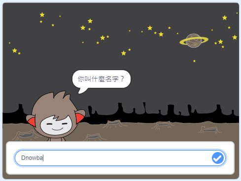

\--- no-print \---

這是一個基於 **Scratch 3 版本** 的專案，這邊也有 [Scratch 2 版本的專案](https://projects.raspberrypi.org/en/projects/chatbot-scratch2)。

\--- /no-print \---

## 概述

您將學習到如何用程式寫出一個會跟你對話的角色! 像這樣的角色我們稱為聊天機器人。

### 您將會做什麼

\--- no-print \---

點擊綠色旗幟，然後點選圖中的聊天機器人開始對話。 當聊天機器人問你問題時，將你的回答輸入再底部的回答框，然後點擊右邊的藍色勾勾(或是按下`Enter`) 來看看機器人的回應

  <iframe allowtransparency="true" width="485" height="402" src="https://scratch.mit.edu/projects/embed/248864190/?autostart=false" 
  frameborder="0" scrolling="no"></iframe>

\--- /no-print \---

\--- print-only \---

\--- /print-only \---

## \--- collapse \---

## title: What you will need

### 硬體

- 相容於 Scratch 3 的電腦

### 軟體

- Scratch 3 ([線上版](https://rpf.io/scratchon) 或 [離線版](https://rpf.io/scratchoff))

### 下載

- [搜尋可下載的資料檔案](http://rpf.io/p/en/chatbot-go)

\--- /collapse \---

## \--- collapse \---

## title: What you will learn

- Use code to concatenate strings in Scratch
- 了解變數可以用來儲存使用者輸入
- Use conditional selection to respond to user input in Scratch

\--- /collapse \---

## \--- collapse \---

## title: Additional notes for educators

\--- no-print \---

If you need to print this project, please use the [printer-friendly version](https://projects.raspberrypi.org/en/projects/chatbot/print){:target="_blank"}.

\--- /no-print \---

You can find the [completed project here](http://rpf.io/p/en/chatbot-get).

\--- /collapse \---