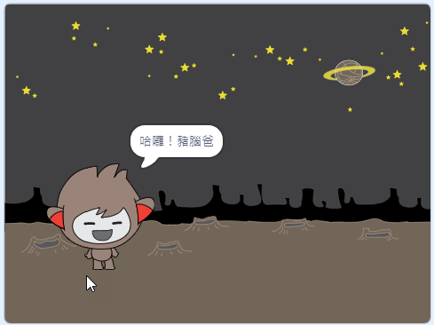

## 會對答的機器人

現在，你已經決定了聊天機器人的個性，你要開始為它編程，讓它能夠與使用者對話。

--- task ---

選取聊天機器人角色，然後添加程式，讓`角色在被點擊`{:class="block3events"}的時候，`詢問你叫什麼名字`{:class="block3sensing"}，然後`說出「這名字真好聽！」`{:class="block3looks"}。


```blocks3
當角色被點擊
詢問 (你叫什麼名字？) 並等待
說出 (這名字真好聽！) 持續 (2) 秒
```

--- /task ---

--- task ---

點擊聊天機器人，看看程式是否正確運行。當聊天機器人詢問你的名字時，你要把名字輸入在舞台底部的文字方塊裡，然後點擊藍色勾勾（或按下鍵盤上的 <kbd>Enter</kbd> 鍵）。


--- /task ---

--- task ---

目前不管輸入什麼名字，你的聊天機器人都會回應「這名字真好聽！」。你可以讓它的反應不要這麼制式，我們讓它能針對不同的名字有不同的反應。

把回應的程式改成`字串組合`{:class="block3operators"}，把「哈囉！」和`詢問的答案`{:class="block3sensing"}給串在一起，程式看起來會像這樣：


```blocks3
當角色被點擊
詢問 (你叫什麼名字？) 並等待
說出 (字串組合 (哈囉！) (詢問的答案) :: +) 持續 (2) 秒
```



--- /task ---

--- task ---

再來只要把詢問的答案暫時儲存在**變數**裡，你就可以在專案的任何時機使用它。

建立一個新的變數，名稱叫`名字`{:class="block3variables"}。

[[[generic-scratch3-add-variable]]]

--- /task ---

--- task ---

現在把聊天機器人的`詢問的答案`{:class="block3sensing"}替換成變數`名字`{:class="block3variables"}：


```blocks3
當角色被點擊
詢問 (你叫什麼名字？) 並等待

+ 變數 [名字 v] 設為 (詢問的答案)
說出 (字串組合 (哈囉！) (名字 :: variables +)) 持續 (2) 秒
```

你的程式應該會像先前那樣運作：聊天機器人現在更像是對著你打招呼了。


--- /task ---

再試試你的程式。 觀察一下，你輸入的答案會儲存在`名字`{:class="block3variables"}這個變數裡，而且會顯示在舞台的左上角。 要讓它在舞台上消失的話，請切換到`變數`類積木，然後取消勾選`名字`{:class="block3variables"}。