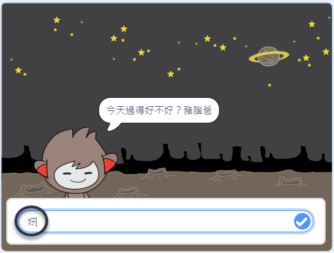
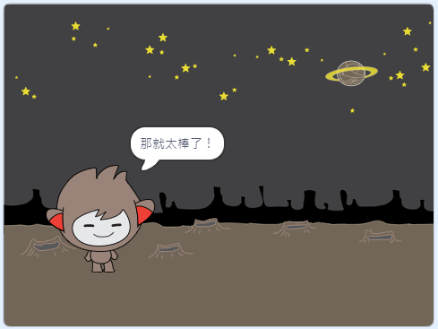
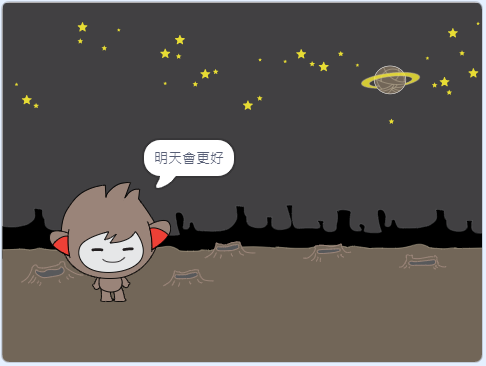
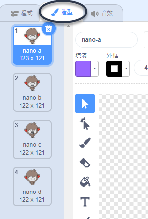
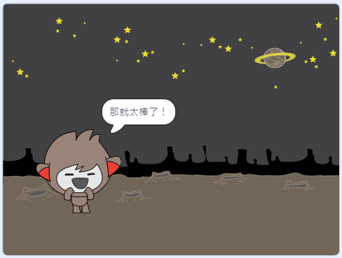
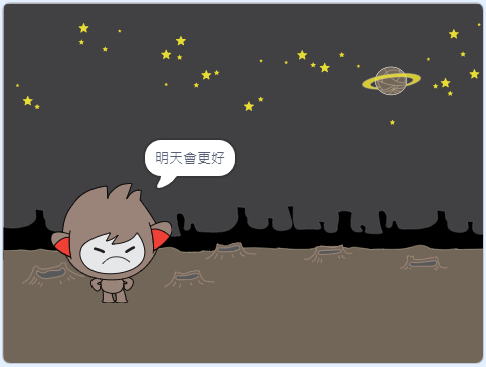
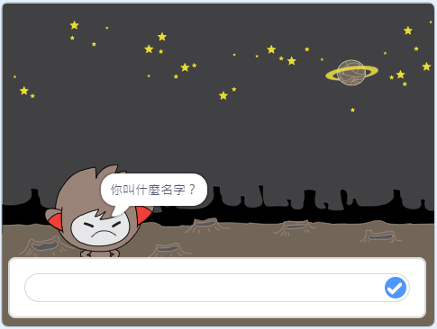
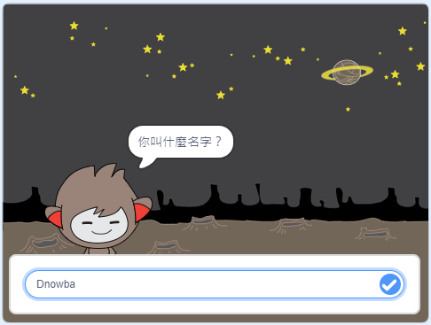

## 會判斷的機器人

你將對聊天機器人編寫程式，讓它依據收到的答案來決定要做什麼。

首先，你將讓聊天機器人問一個可以用「是」或「不是」的方式來回答的問題。

\--- task \---

修改一下聊天機器人的程式， 它要詢問使用者「今天過得好不好？」，最後再加上使用者的`名字`{:class="block3variables"} 。 `如果`{:class="block3control"}使用者回答「好」，聊天機器人就會回應「那就太棒了！」；使用者說「不好」，那它就什麼也不回應。






```blocks3
當角色被點擊
詢問 (你叫什麼名字？) 並等待
變數 [名字 v] 設為 (詢問的答案)
說出 (字串組合 (哈囉！) (詢問的答案)) 持續 (2) 秒
+ 詢問 (字串組合 (今天過得好不好？) (名字)) 並等待
+ 如果 <(詢問的答案) = (好)> 那麼
  說出 (那就太棒了！) 持續 (2) 秒
end
```

為了正確測試程式，你應該要測試**兩次**：一次輸入答案「好」，另一次回答「不好」。

\--- /task \---

At the moment, your chatbot doesn't say anything to the answer "no".

\--- task \---

修改聊天機器人的程式，在它問完「今天過得好不好？」之後，如果得到的回答是「不好」，那麼就回應「明天會更好」。

把原來的`如果…那麼`{:class="block3control"}積木換成`如果…那麼…否則`{:class="block3control"}積木，這樣子機器人對其餘的回答`說出「明天會更好」`{:class="block3looks"}。


```blocks3
當角色被點擊
詢問 (你叫什麼名字？) 並等待
變數 [名字 v] 設為 (詢問的答案)
說出 (字串組合 (哈囉！) (詢問的答案)) 持續 (2) 秒
詢問 (字串組合 (今天過得好不好？) (名字)) 並等待

+ 如果 <(詢問的答案) = (好)> 那麼
  說出 (那就太棒了！) 持續 (2) 秒
否則
+ 說出 (明天會更好) 持續 (2) 秒
end
```

\--- /task \---

\--- task \---

測試你的程式。 你應該會在回答「不好」後，在機器人身上得到不同的回應。事實上，只要你的回答**是「好」的以外的答案**的時候，機器人都會說「明天會更好」。




\--- /task \---

你可以在`如果…那麼…否則`{:class="block3control"}的區段裡編寫任何程式，不一定是「說出」這種外觀類積木！

如果你切換到聊天機器人的**造型**頁籤，你可以看到這個角色預設的造型不只一種。



\--- task \---

修改聊天機器人的程式，讓它在使用者回答時變換造型。





修改`如果…那麼…否則`{:class="block3control"}區段的程式，添加`切換造型`{:class="block3looks"}的程式。


```blocks3
當角色被點擊
詢問 (你叫什麼名字？) 並等待
變數 [名字 v] 設為 (詢問的答案)
說出 (字串組合 (哈囉！) (詢問的答案)) 持續 (2) 秒
詢問 (字串組合 (今天過得好不好？) (名字)) 並等待
如果 <(詢問的答案) = (好)> 那麼

+ 造型換成 (nano-c v)
  說出 (那就太棒了！) 持續 (2) 秒
否則
+ 造型換成 (nano-d v)
  說出 (明天會更好) 持續 (2) 秒
end
```

測試並儲存你的程式，你應該會看到聊天機器人會根據使用者的回答有不同的外觀反應。

\--- /task \---

觀察到了嗎？在更改聊天機器人的造型後，它會持續這個外觀，不會恢復到一開始時的樣子。

你可以測試看看：運行程式後回答「不好」，這樣機器人會露出不高興的表情。 接著，你再點擊角色重新開始程式，觀察看看機器人在詢問你的名字前，臉上的表情是開心的嗎？



\--- task \---

要解決這個問題，必須在聊天機器人程式的一開始，也就是`當角色被點擊`{:class="block3events"}的時候，先`切換一個預定的造型`{:class="block3looks"}。


```blocks3
當角色被點擊

+ 造型換成 (nano-a v)
詢問 (你叫什麼名字？) 並等待
```



\--- /task \---