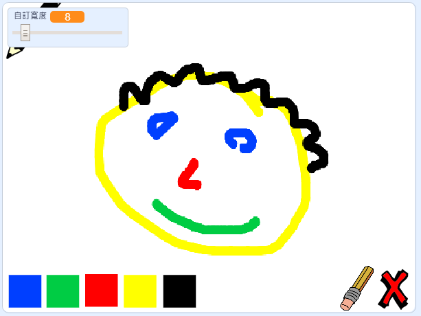

## 然後呢？

試試[畫圖工具盒](https://projects.raspberrypi.org/en/projects/paint-box?utm_source=pathway&utm_medium=whatnext&utm_campaign=projects)專案，做個你自己的繪圖工具程式！

--- no-print ---

點擊綠旗開始， 用滑鼠移動鉛筆，按住滑鼠左鍵就可以開始畫圖， 點擊色塊改變鉛筆顏色， 點擊擦子就可以用它來擦掉筆跡， 要清空頁面的話就點一下叉叉圖案。

  <iframe allowtransparency="true" width="485" height="402" src="//scratch.mit.edu/projects/embed/267243161/?autostart=false" frameborder="0" scrolling="no"></iframe>
  

--- /no-print ---

--- print-only ---

點擊綠旗開始， 用滑鼠移動鉛筆，按住滑鼠左鍵就可以開始畫圖， 點擊色塊改變鉛筆顏色， 點擊擦子就可以用它來擦掉筆跡， 要清空頁面的話就點一下叉叉圖案。

--- /print-only ---
